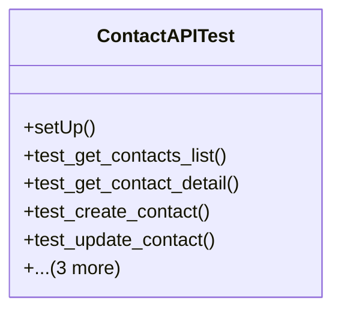

# business_modules.contacts.tests.test_api

## Imports
- business_modules.contacts.models
- core_modules.companies.models
- django.contrib.auth
- django.core.exceptions
- django.urls
- rest_framework
- rest_framework.test

## Classes
- ContactAPITest
  - method: `setUp`
  - method: `test_get_contacts_list`
  - method: `test_get_contact_detail`
  - method: `test_create_contact`
  - method: `test_update_contact`
  - method: `test_delete_contact`
  - method: `test_filter_contacts_by_type`
  - method: `test_search_contacts`

## Functions
- setUp
- test_get_contacts_list
- test_get_contact_detail
- test_create_contact
- test_update_contact
- test_delete_contact
- test_filter_contacts_by_type
- test_search_contacts

## Module Variables
- `User`

## Class Diagram

