# business_modules.contacts.tests.test_contacts

## Imports
- core_modules.core.models
- datetime
- decimal
- django.core.exceptions
- django.db
- django.test
- django.utils
- models.address
- models.communication
- models.contact

## Classes
- ContactCategoryModelTest
  - method: `setUp`
  - method: `test_create_category`
  - method: `test_unique_code_per_company`
  - method: `test_deactivate_category`
- ContactTagModelTest
  - method: `setUp`
  - method: `test_create_tag`
  - method: `test_unique_code_per_company`
  - method: `test_deactivate_tag`
- CountryModelTest
  - method: `setUp`
  - method: `test_create_country`
  - method: `test_unique_code`
  - method: `test_deactivate_country`
- CityModelTest
  - method: `setUp`
  - method: `test_create_city`
  - method: `test_unique_code_per_country`
  - method: `test_deactivate_city`
- AddressModelTest
  - method: `setUp`
  - method: `test_create_address`
  - method: `test_default_address_constraint`
  - method: `test_get_full_address`
- ContactModelTest
  - method: `setUp`
  - method: `test_create_contact`
  - method: `test_add_categories_and_tags`
  - method: `test_deactivate_contact`
  - method: `test_get_primary_address`
  - method: `test_get_communication_logs`
- CommunicationTypeModelTest
  - method: `setUp`
  - method: `test_create_communication_type`
  - method: `test_unique_code_per_company`
  - method: `test_deactivate_communication_type`
- CommunicationLogModelTest
  - method: `setUp`
  - method: `test_create_communication_log`
  - method: `test_log_with_duration_and_outcome`
  - method: `test_get_user_full_name`
  - method: `test_get_formatted_date`

## Functions
- setUp
- test_create_category
- test_unique_code_per_company
- test_deactivate_category
- setUp
- test_create_tag
- test_unique_code_per_company
- test_deactivate_tag
- setUp
- test_create_country
- test_unique_code
- test_deactivate_country
- setUp
- test_create_city
- test_unique_code_per_country
- test_deactivate_city
- setUp
- test_create_address
- test_default_address_constraint
- test_get_full_address
- setUp
- test_create_contact
- test_add_categories_and_tags
- test_deactivate_contact
- test_get_primary_address
- test_get_communication_logs
- setUp
- test_create_communication_type
- test_unique_code_per_company
- test_deactivate_communication_type
- setUp
- test_create_communication_log
- test_log_with_duration_and_outcome
- test_get_user_full_name
- test_get_formatted_date
- mock_set_as_default
- mock_get_full_address
- mock_get_primary_address
- mock_get_communication_logs
- mock_get_user_full_name
- mock_get_formatted_date

## Class Diagram

```mermaid
classDiagram
    class ContactCategoryModelTest {
        +setUp()
        +test_create_category()
        +test_unique_code_per_company()
        +test_deactivate_category()
    }
    class ContactTagModelTest {
        +setUp()
        +test_create_tag()
        +test_unique_code_per_company()
        +test_deactivate_tag()
    }
    class CountryModelTest {
        +setUp()
        +test_create_country()
        +test_unique_code()
        +test_deactivate_country()
    }
    class CityModelTest {
        +setUp()
        +test_create_city()
        +test_unique_code_per_country()
        +test_deactivate_city()
    }
    class AddressModelTest {
        +setUp()
        +test_create_address()
        +test_default_address_constraint()
        +test_get_full_address()
    }
    class ContactModelTest {
        +setUp()
        +test_create_contact()
        +test_add_categories_and_tags()
        +test_deactivate_contact()
        +test_get_primary_address()
        +... (1 more)
    }
    class CommunicationTypeModelTest {
        +setUp()
        +test_create_communication_type()
        +test_unique_code_per_company()
        +test_deactivate_communication_type()
    }
    class CommunicationLogModelTest {
        +setUp()
        +test_create_communication_log()
        +test_log_with_duration_and_outcome()
        +test_get_user_full_name()
        +test_get_formatted_date()
    }
```

