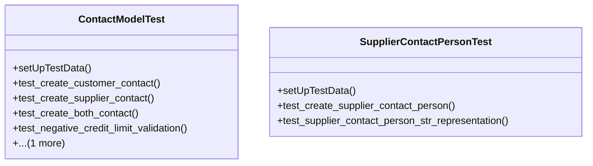

# business_modules.contacts.tests.test_models

## Imports
- core.models
- core_modules.accounting.models
- core_modules.contacts.models
- core_modules.purchasing.models
- decimal
- django.contrib.auth
- django.core.exceptions
- django.test

## Classes
- ContactModelTest
  - method: `setUpTestData`
  - method: `test_create_customer_contact`
  - method: `test_create_supplier_contact`
  - method: `test_create_both_contact`
  - method: `test_negative_credit_limit_validation`
  - method: `test_contact_str_representation`
- SupplierContactPersonTest
  - method: `setUpTestData`
  - method: `test_create_supplier_contact_person`
  - method: `test_supplier_contact_person_str_representation`

## Functions
- setUpTestData
- test_create_customer_contact
- test_create_supplier_contact
- test_create_both_contact
- test_negative_credit_limit_validation
- test_contact_str_representation
- setUpTestData
- test_create_supplier_contact_person
- test_supplier_contact_person_str_representation

## Module Variables
- `User`

## Class Diagram

