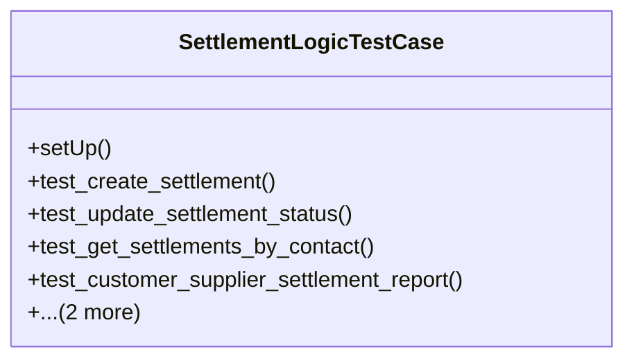

# business_modules.contacts.tests.test_settlement_logic

## Imports
- decimal
- django.contrib.auth
- django.test
- django.utils
- models
- services

## Classes
- SettlementLogicTestCase
  - method: `setUp`
  - method: `test_create_settlement`
  - method: `test_update_settlement_status`
  - method: `test_get_settlements_by_contact`
  - method: `test_customer_supplier_settlement_report`
  - method: `test_invalid_settlement_for_customer_only`
  - method: `test_settlement_with_zero_amount`

## Functions
- setUp
- test_create_settlement
- test_update_settlement_status
- test_get_settlements_by_contact
- test_customer_supplier_settlement_report
- test_invalid_settlement_for_customer_only
- test_settlement_with_zero_amount

## Module Variables
- `User`

## Class Diagram

