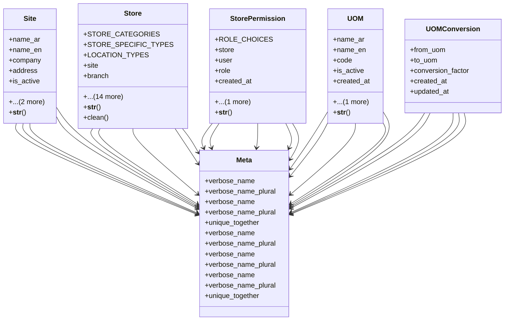

# business_modules.inventory.base

## Imports
- core_modules.organization.models
- decimal
- django.conf
- django.contrib
- django.contrib.auth.models
- django.core.exceptions
- django.db
- django.utils.translation

## Classes
- Site
  - attr: `name_ar`
  - attr: `name_en`
  - attr: `company`
  - attr: `address`
  - attr: `is_active`
  - attr: `created_at`
  - attr: `updated_at`
  - method: `__str__`
- Store
  - attr: `STORE_CATEGORIES`
  - attr: `STORE_SPECIFIC_TYPES`
  - attr: `LOCATION_TYPES`
  - attr: `site`
  - attr: `branch`
  - attr: `parent`
  - attr: `name_ar`
  - attr: `name_en`
  - attr: `location_type`
  - attr: `category`
  - attr: `specific_type`
  - attr: `description`
  - attr: `requires_temp_control`
  - attr: `temperature_min`
  - attr: `temperature_max`
  - attr: `storage_cost_per_day`
  - attr: `is_active`
  - attr: `created_at`
  - attr: `updated_at`
  - method: `__str__`
  - method: `clean`
- StorePermission
  - attr: `ROLE_CHOICES`
  - attr: `store`
  - attr: `user`
  - attr: `role`
  - attr: `created_at`
  - attr: `updated_at`
  - method: `__str__`
- UOM
  - attr: `name_ar`
  - attr: `name_en`
  - attr: `code`
  - attr: `is_active`
  - attr: `created_at`
  - attr: `updated_at`
  - method: `__str__`
- UOMConversion
  - attr: `from_uom`
  - attr: `to_uom`
  - attr: `conversion_factor`
  - attr: `created_at`
  - attr: `updated_at`
- Meta
  - attr: `verbose_name`
  - attr: `verbose_name_plural`
- Meta
  - attr: `verbose_name`
  - attr: `verbose_name_plural`
- Meta
  - attr: `unique_together`
  - attr: `verbose_name`
  - attr: `verbose_name_plural`
- Meta
  - attr: `verbose_name`
  - attr: `verbose_name_plural`
- Meta
  - attr: `verbose_name`
  - attr: `verbose_name_plural`
  - attr: `unique_together`

## Functions
- __str__
- __str__
- clean
- __str__
- __str__

## Module Variables
- `User`

## Class Diagram

