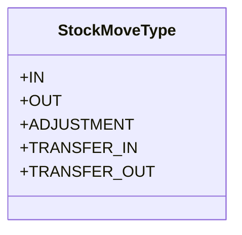

# business_modules.inventory.compat_types

## Classes
- StockMoveType
  - attr: `IN`
  - attr: `OUT`
  - attr: `ADJUSTMENT`
  - attr: `TRANSFER_IN`
  - attr: `TRANSFER_OUT`

## Class Diagram

```mermaid
classDiagram
    class StockMoveType {
        +IN
        +OUT
        +ADJUSTMENT
        +TRANSFER_IN
        +TRANSFER_OUT
    }
```
