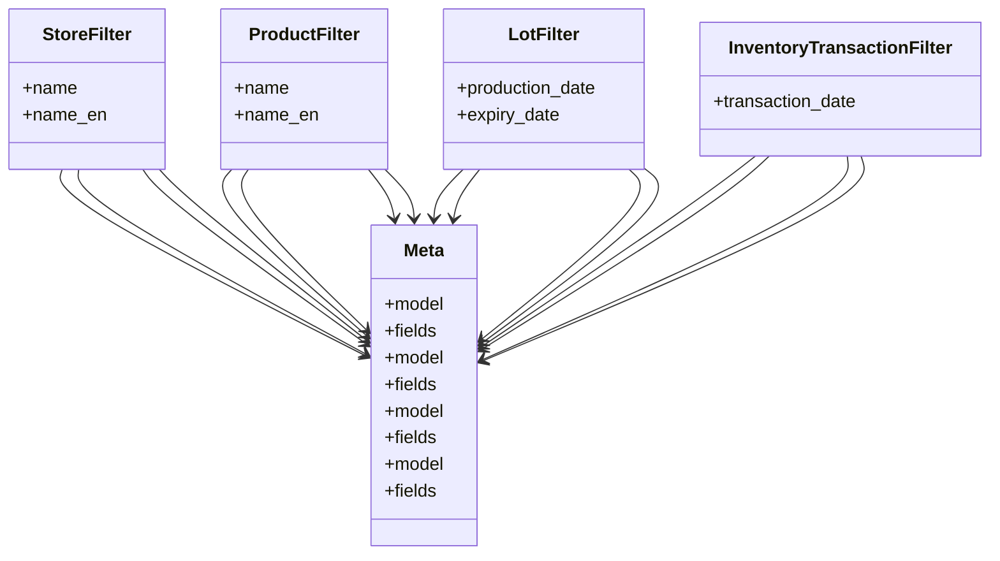

# business_modules.inventory.filters

## Imports
- compat
- django.db
- django_filters
- models
- tracking

## Classes
- StoreFilter
  - attr: `name`
  - attr: `name_en`
- ProductFilter
  - attr: `name`
  - attr: `name_en`
- LotFilter
  - attr: `production_date`
  - attr: `expiry_date`
- InventoryTransactionFilter
  - attr: `transaction_date`
- Meta
  - attr: `model`
  - attr: `fields`
- Meta
  - attr: `model`
  - attr: `fields`
- Meta
  - attr: `model`
  - attr: `fields`
- Meta
  - attr: `model`
  - attr: `fields`

## Class Diagram

