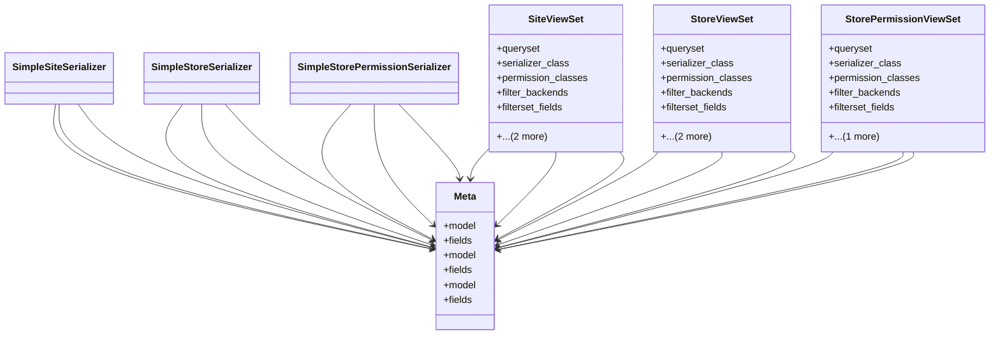

# business_modules.inventory.location_views

## Imports
- base
- django.db
- django_filters.rest_framework
- rest_framework

## Classes
- SimpleSiteSerializer
- SimpleStoreSerializer
- SimpleStorePermissionSerializer
- SiteViewSet
  - attr: `queryset`
  - attr: `serializer_class`
  - attr: `permission_classes`
  - attr: `filter_backends`
  - attr: `filterset_fields`
  - attr: `search_fields`
  - attr: `ordering_fields`
- StoreViewSet
  - attr: `queryset`
  - attr: `serializer_class`
  - attr: `permission_classes`
  - attr: `filter_backends`
  - attr: `filterset_fields`
  - attr: `search_fields`
  - attr: `ordering_fields`
- StorePermissionViewSet
  - attr: `queryset`
  - attr: `serializer_class`
  - attr: `permission_classes`
  - attr: `filter_backends`
  - attr: `filterset_fields`
  - attr: `ordering_fields`
- Meta
  - attr: `model`
  - attr: `fields`
- Meta
  - attr: `model`
  - attr: `fields`
- Meta
  - attr: `model`
  - attr: `fields`

## Class Diagram

