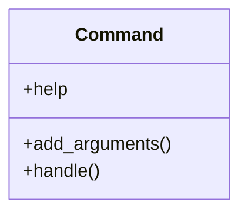

# business_modules.inventory.management.commands.create_sample_inventory

## Imports
- business_modules.inventory.models
- core_modules.companies.models
- decimal
- django.core.management.base
- django.db
- random

## Classes
- Command
  - attr: `help`
  - method: `add_arguments`
  - method: `handle`

## Functions
- add_arguments
- handle

## Class Diagram

