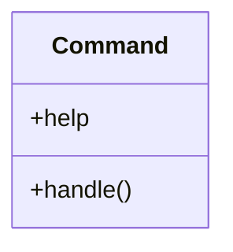

# business_modules.inventory.management.commands.create_sample_uom_categories

## Imports
- business_modules.inventory.models
- django.core.management.base
- django.db

## Classes
- Command
  - attr: `help`
  - method: `handle`

## Functions
- handle

## Class Diagram

