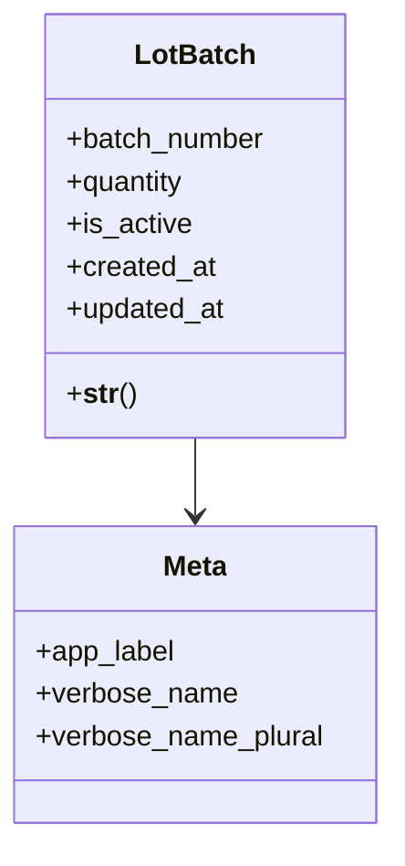

# business_modules.inventory.models.lot_batch

## Imports
- decimal
- django.db
- django.utils.translation

## Classes
- LotBatch
  - attr: `batch_number`
  - attr: `quantity`
  - attr: `is_active`
  - attr: `created_at`
  - attr: `updated_at`
  - method: `__str__`
- Meta
  - attr: `app_label`
  - attr: `verbose_name`
  - attr: `verbose_name_plural`

## Functions
- __str__

## Class Diagram

