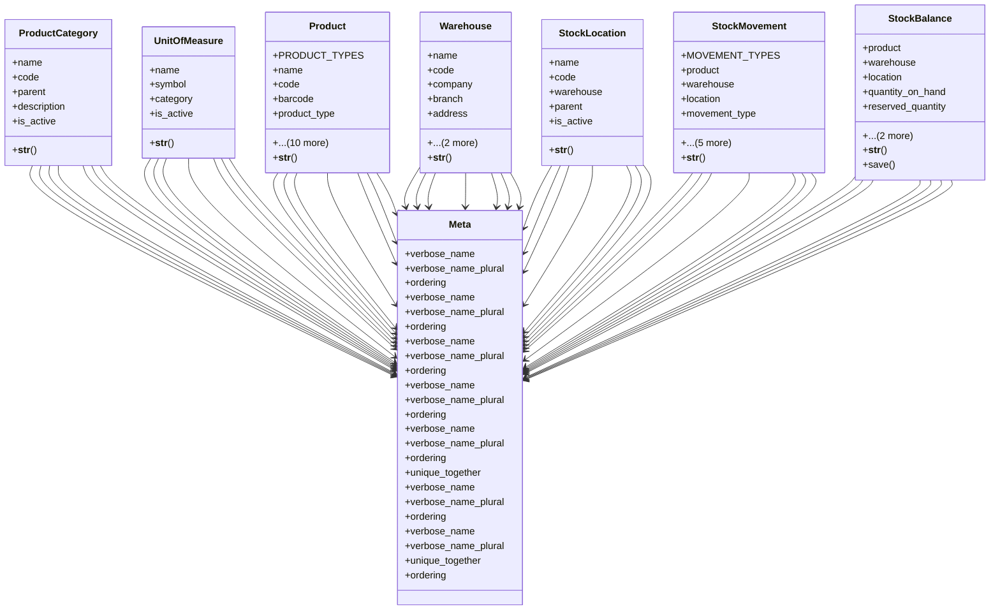

# business_modules.inventory.models

## Imports
- core_modules.companies.models
- core_modules.core.models.base_models
- decimal
- django.db

## Classes
- ProductCategory
  - attr: `name`
  - attr: `code`
  - attr: `parent`
  - attr: `description`
  - attr: `is_active`
  - method: `__str__`
- UnitOfMeasure
  - attr: `name`
  - attr: `symbol`
  - attr: `category`
  - attr: `is_active`
  - method: `__str__`
- Product
  - attr: `PRODUCT_TYPES`
  - attr: `name`
  - attr: `code`
  - attr: `barcode`
  - attr: `product_type`
  - attr: `category`
  - attr: `unit_of_measure`
  - attr: `sale_price`
  - attr: `cost_price`
  - attr: `can_be_sold`
  - attr: `can_be_purchased`
  - attr: `track_inventory`
  - attr: `description`
  - attr: `notes`
  - attr: `is_active`
  - method: `__str__`
- Warehouse
  - attr: `name`
  - attr: `code`
  - attr: `company`
  - attr: `branch`
  - attr: `address`
  - attr: `manager`
  - attr: `is_active`
  - method: `__str__`
- StockLocation
  - attr: `name`
  - attr: `code`
  - attr: `warehouse`
  - attr: `parent`
  - attr: `is_active`
  - method: `__str__`
- StockMovement
  - attr: `MOVEMENT_TYPES`
  - attr: `product`
  - attr: `warehouse`
  - attr: `location`
  - attr: `movement_type`
  - attr: `quantity`
  - attr: `unit_cost`
  - attr: `reference`
  - attr: `notes`
  - attr: `movement_date`
  - method: `__str__`
- StockBalance
  - attr: `product`
  - attr: `warehouse`
  - attr: `location`
  - attr: `quantity_on_hand`
  - attr: `reserved_quantity`
  - attr: `available_quantity`
  - attr: `last_updated`
  - method: `__str__`
  - method: `save`
- Meta
  - attr: `verbose_name`
  - attr: `verbose_name_plural`
  - attr: `ordering`
- Meta
  - attr: `verbose_name`
  - attr: `verbose_name_plural`
  - attr: `ordering`
- Meta
  - attr: `verbose_name`
  - attr: `verbose_name_plural`
  - attr: `ordering`
- Meta
  - attr: `verbose_name`
  - attr: `verbose_name_plural`
  - attr: `ordering`
- Meta
  - attr: `verbose_name`
  - attr: `verbose_name_plural`
  - attr: `ordering`
  - attr: `unique_together`
- Meta
  - attr: `verbose_name`
  - attr: `verbose_name_plural`
  - attr: `ordering`
- Meta
  - attr: `verbose_name`
  - attr: `verbose_name_plural`
  - attr: `unique_together`
  - attr: `ordering`

## Functions
- __str__
- __str__
- __str__
- __str__
- __str__
- __str__
- __str__
- save

## Class Diagram

