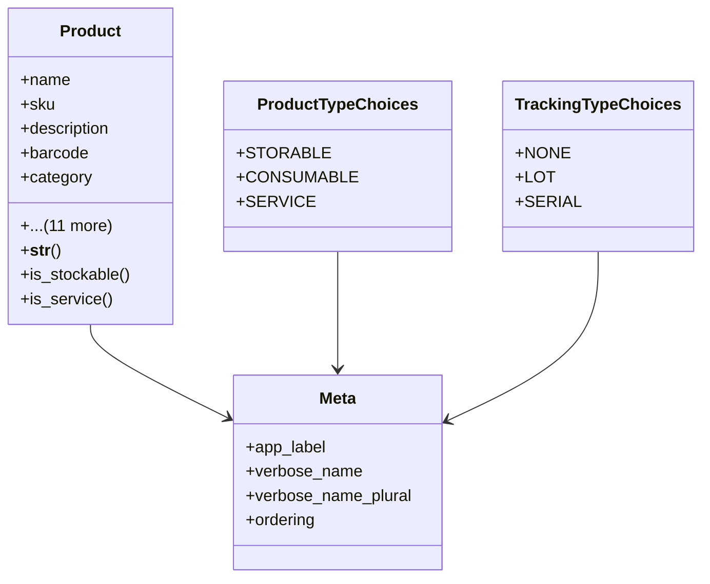

# business_modules.inventory.models.product

## Imports
- decimal
- django.db
- django.utils.translation
- product_category

## Classes
- Product
  - attr: `name`
  - attr: `sku`
  - attr: `description`
  - attr: `barcode`
  - attr: `category`
  - attr: `product_type`
  - attr: `tracking_type`
  - attr: `sale_price`
  - attr: `list_price`
  - attr: `cost_price`
  - attr: `quantity_on_hand`
  - attr: `is_active`
  - attr: `can_be_sold`
  - attr: `can_be_purchased`
  - attr: `created_at`
  - attr: `updated_at`
  - method: `__str__`
  - method: `is_stockable`
  - method: `is_service`
- ProductTypeChoices
  - attr: `STORABLE`
  - attr: `CONSUMABLE`
  - attr: `SERVICE`
- TrackingTypeChoices
  - attr: `NONE`
  - attr: `LOT`
  - attr: `SERIAL`
- Meta
  - attr: `app_label`
  - attr: `verbose_name`
  - attr: `verbose_name_plural`
  - attr: `ordering`

## Functions
- __str__
- is_stockable
- is_service

## Class Diagram

