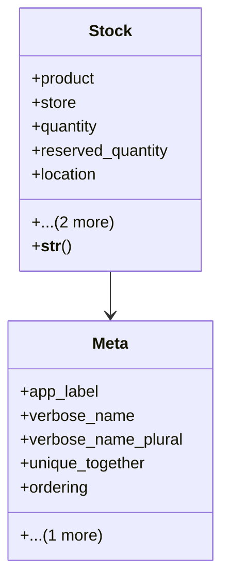

# business_modules.inventory.models.stock

## Imports
- decimal
- django.db
- django.utils.translation
- product
- store

## Classes
- Stock
  - attr: `product`
  - attr: `store`
  - attr: `quantity`
  - attr: `reserved_quantity`
  - attr: `location`
  - attr: `created_at`
  - attr: `updated_at`
  - method: `__str__`
- Meta
  - attr: `app_label`
  - attr: `verbose_name`
  - attr: `verbose_name_plural`
  - attr: `unique_together`
  - attr: `ordering`
  - attr: `indexes`

## Functions
- __str__

## Class Diagram

