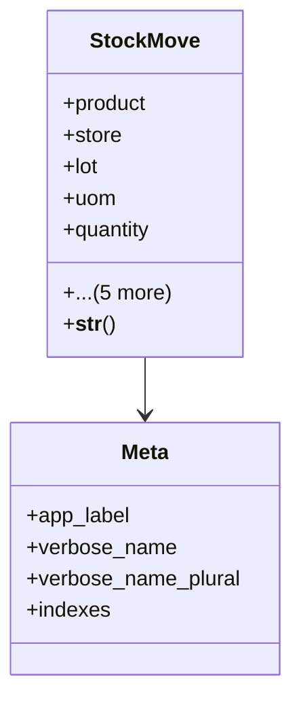

# business_modules.inventory.models.stock_move

## Imports
- compat_types
- django.db
- django.utils.translation
- lot
- product
- store
- uom

## Classes
- StockMove
  - attr: `product`
  - attr: `store`
  - attr: `lot`
  - attr: `uom`
  - attr: `quantity`
  - attr: `unit_cost`
  - attr: `move_type`
  - attr: `reference`
  - attr: `created_at`
  - attr: `updated_at`
  - method: `__str__`
- Meta
  - attr: `app_label`
  - attr: `verbose_name`
  - attr: `verbose_name_plural`
  - attr: `indexes`

## Functions
- __str__

## Class Diagram

