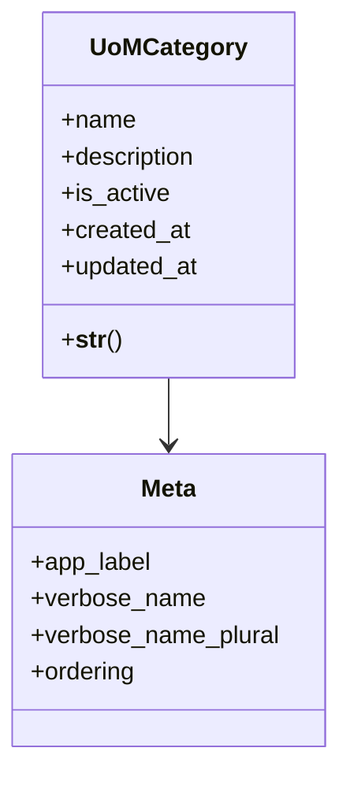

# business_modules.inventory.models.uom_category

## Imports
- django.db
- django.utils.translation

## Classes
- UoMCategory
  - attr: `name`
  - attr: `description`
  - attr: `is_active`
  - attr: `created_at`
  - attr: `updated_at`
  - method: `__str__`
- Meta
  - attr: `app_label`
  - attr: `verbose_name`
  - attr: `verbose_name_plural`
  - attr: `ordering`

## Functions
- __str__

## Class Diagram

