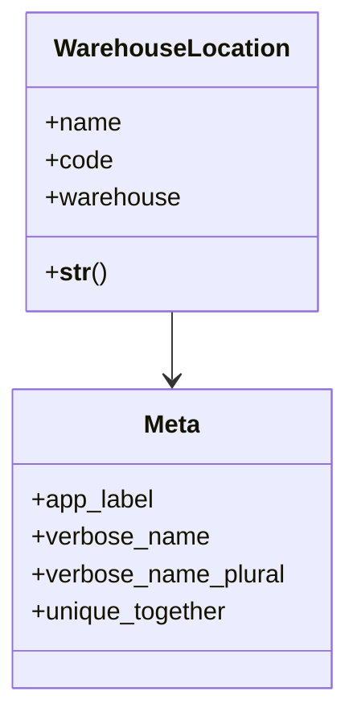

# business_modules.inventory.models.warehouse_location

## Imports
- django.db
- django.utils.translation

## Classes
- WarehouseLocation
  - attr: `name`
  - attr: `code`
  - attr: `warehouse`
  - method: `__str__`
- Meta
  - attr: `app_label`
  - attr: `verbose_name`
  - attr: `verbose_name_plural`
  - attr: `unique_together`

## Functions
- __str__

## Class Diagram

