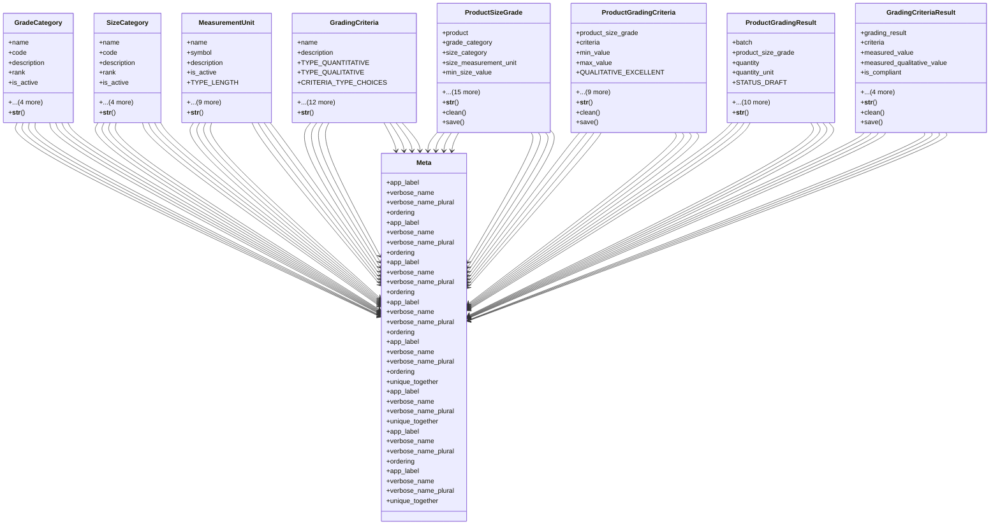

# business_modules.inventory.product_grading.models

## Imports
- django.conf
- django.core.exceptions
- django.core.validators
- django.db
- django.utils.translation
- models

## Classes
- GradeCategory
  - attr: `name`
  - attr: `code`
  - attr: `description`
  - attr: `rank`
  - attr: `is_active`
  - attr: `created_at`
  - attr: `updated_at`
  - attr: `created_by`
  - attr: `updated_by`
  - method: `__str__`
- SizeCategory
  - attr: `name`
  - attr: `code`
  - attr: `description`
  - attr: `rank`
  - attr: `is_active`
  - attr: `created_at`
  - attr: `updated_at`
  - attr: `created_by`
  - attr: `updated_by`
  - method: `__str__`
- MeasurementUnit
  - attr: `name`
  - attr: `symbol`
  - attr: `description`
  - attr: `is_active`
  - attr: `TYPE_LENGTH`
  - attr: `TYPE_WEIGHT`
  - attr: `TYPE_VOLUME`
  - attr: `TYPE_COUNT`
  - attr: `TYPE_PERCENTAGE`
  - attr: `TYPE_OTHER`
  - attr: `UNIT_TYPE_CHOICES`
  - attr: `unit_type`
  - attr: `created_at`
  - attr: `updated_at`
  - method: `__str__`
- GradingCriteria
  - attr: `name`
  - attr: `description`
  - attr: `TYPE_QUANTITATIVE`
  - attr: `TYPE_QUALITATIVE`
  - attr: `CRITERIA_TYPE_CHOICES`
  - attr: `criteria_type`
  - attr: `measurement_unit`
  - attr: `IMPORTANCE_CRITICAL`
  - attr: `IMPORTANCE_MAJOR`
  - attr: `IMPORTANCE_MINOR`
  - attr: `IMPORTANCE_CHOICES`
  - attr: `importance`
  - attr: `is_active`
  - attr: `created_at`
  - attr: `updated_at`
  - attr: `created_by`
  - attr: `updated_by`
  - method: `__str__`
- ProductSizeGrade
  - attr: `product`
  - attr: `grade_category`
  - attr: `size_category`
  - attr: `size_measurement_unit`
  - attr: `min_size_value`
  - attr: `max_size_value`
  - attr: `reference_price`
  - attr: `MARKET_LOCAL`
  - attr: `MARKET_EXPORT`
  - attr: `MARKET_BOTH`
  - attr: `MARKET_CHOICES`
  - attr: `target_market`
  - attr: `description`
  - attr: `notes`
  - attr: `is_active`
  - attr: `created_at`
  - attr: `updated_at`
  - attr: `created_by`
  - attr: `updated_by`
  - attr: `grading_criteria`
  - method: `__str__`
  - method: `clean`
  - method: `save`
- ProductGradingCriteria
  - attr: `product_size_grade`
  - attr: `criteria`
  - attr: `min_value`
  - attr: `max_value`
  - attr: `QUALITATIVE_EXCELLENT`
  - attr: `QUALITATIVE_GOOD`
  - attr: `QUALITATIVE_ACCEPTABLE`
  - attr: `QUALITATIVE_POOR`
  - attr: `QUALITATIVE_UNACCEPTABLE`
  - attr: `QUALITATIVE_CHOICES`
  - attr: `qualitative_value`
  - attr: `value_description`
  - attr: `created_at`
  - attr: `updated_at`
  - method: `__str__`
  - method: `clean`
  - method: `save`
- ProductGradingResult
  - attr: `batch`
  - attr: `product_size_grade`
  - attr: `quantity`
  - attr: `quantity_unit`
  - attr: `STATUS_DRAFT`
  - attr: `STATUS_CONFIRMED`
  - attr: `STATUS_CANCELLED`
  - attr: `STATUS_CHOICES`
  - attr: `status`
  - attr: `notes`
  - attr: `grading_date`
  - attr: `created_at`
  - attr: `updated_at`
  - attr: `created_by`
  - attr: `updated_by`
  - method: `__str__`
- GradingCriteriaResult
  - attr: `grading_result`
  - attr: `criteria`
  - attr: `measured_value`
  - attr: `measured_qualitative_value`
  - attr: `is_compliant`
  - attr: `non_compliance_notes`
  - attr: `created_at`
  - attr: `updated_at`
  - attr: `created_by`
  - method: `__str__`
  - method: `clean`
  - method: `save`
- Meta
  - attr: `app_label`
  - attr: `verbose_name`
  - attr: `verbose_name_plural`
  - attr: `ordering`
- Meta
  - attr: `app_label`
  - attr: `verbose_name`
  - attr: `verbose_name_plural`
  - attr: `ordering`
- Meta
  - attr: `app_label`
  - attr: `verbose_name`
  - attr: `verbose_name_plural`
  - attr: `ordering`
- Meta
  - attr: `app_label`
  - attr: `verbose_name`
  - attr: `verbose_name_plural`
  - attr: `ordering`
- Meta
  - attr: `app_label`
  - attr: `verbose_name`
  - attr: `verbose_name_plural`
  - attr: `ordering`
  - attr: `unique_together`
- Meta
  - attr: `app_label`
  - attr: `verbose_name`
  - attr: `verbose_name_plural`
  - attr: `unique_together`
- Meta
  - attr: `app_label`
  - attr: `verbose_name`
  - attr: `verbose_name_plural`
  - attr: `ordering`
- Meta
  - attr: `app_label`
  - attr: `verbose_name`
  - attr: `verbose_name_plural`
  - attr: `unique_together`

## Functions
- __str__
- __str__
- __str__
- __str__
- __str__
- clean
- save
- __str__
- clean
- save
- __str__
- __str__
- clean
- save

## Module Variables
- `ProductionBatch`

## Class Diagram

