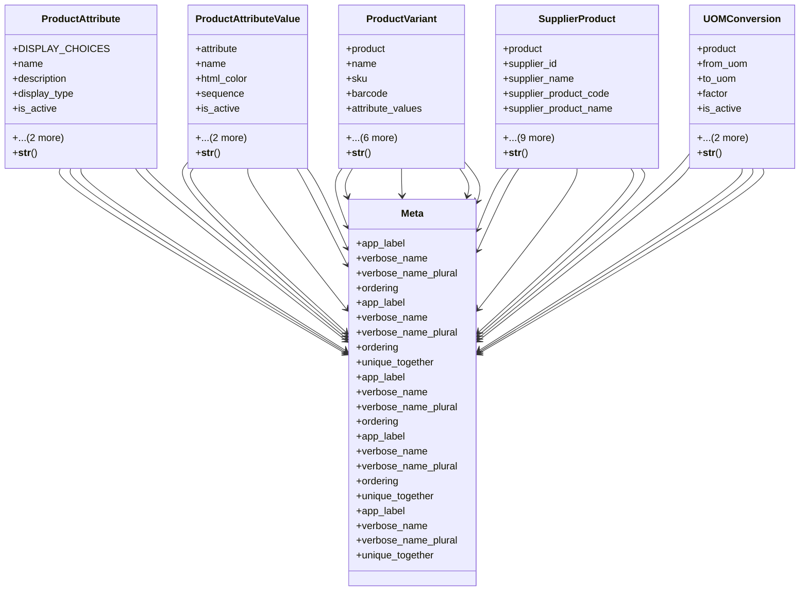

# business_modules.inventory.products

## Imports
- decimal
- django.db
- django.utils.translation
- models

## Classes
- ProductAttribute
  - attr: `DISPLAY_CHOICES`
  - attr: `name`
  - attr: `description`
  - attr: `display_type`
  - attr: `is_active`
  - attr: `created_at`
  - attr: `updated_at`
  - method: `__str__`
- ProductAttributeValue
  - attr: `attribute`
  - attr: `name`
  - attr: `html_color`
  - attr: `sequence`
  - attr: `is_active`
  - attr: `created_at`
  - attr: `updated_at`
  - method: `__str__`
- ProductVariant
  - attr: `product`
  - attr: `name`
  - attr: `sku`
  - attr: `barcode`
  - attr: `attribute_values`
  - attr: `sale_price`
  - attr: `cost_price`
  - attr: `quantity_on_hand`
  - attr: `is_active`
  - attr: `created_at`
  - attr: `updated_at`
  - method: `__str__`
- SupplierProduct
  - attr: `product`
  - attr: `supplier_id`
  - attr: `supplier_name`
  - attr: `supplier_product_code`
  - attr: `supplier_product_name`
  - attr: `purchase_price`
  - attr: `purchase_uom`
  - attr: `min_order_qty`
  - attr: `lead_time_days`
  - attr: `is_preferred`
  - attr: `notes`
  - attr: `is_active`
  - attr: `created_at`
  - attr: `updated_at`
  - method: `__str__`
- UOMConversion
  - attr: `product`
  - attr: `from_uom`
  - attr: `to_uom`
  - attr: `factor`
  - attr: `is_active`
  - attr: `created_at`
  - attr: `updated_at`
  - method: `__str__`
- Meta
  - attr: `app_label`
  - attr: `verbose_name`
  - attr: `verbose_name_plural`
  - attr: `ordering`
- Meta
  - attr: `app_label`
  - attr: `verbose_name`
  - attr: `verbose_name_plural`
  - attr: `ordering`
  - attr: `unique_together`
- Meta
  - attr: `app_label`
  - attr: `verbose_name`
  - attr: `verbose_name_plural`
  - attr: `ordering`
- Meta
  - attr: `app_label`
  - attr: `verbose_name`
  - attr: `verbose_name_plural`
  - attr: `ordering`
  - attr: `unique_together`
- Meta
  - attr: `app_label`
  - attr: `verbose_name`
  - attr: `verbose_name_plural`
  - attr: `unique_together`

## Functions
- __str__
- __str__
- __str__
- __str__
- __str__

## Class Diagram

