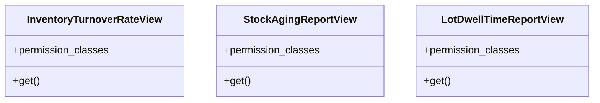

# business_modules.inventory.report_views

## Imports
- datetime
- django.db
- django.db.models
- models
- rest_framework
- rest_framework.response
- rest_framework.views
- time
- tracking
- utils

## Classes
- InventoryTurnoverRateView
  - attr: `permission_classes`
  - method: `get`
- StockAgingReportView
  - attr: `permission_classes`
  - method: `get`
- LotDwellTimeReportView
  - attr: `permission_classes`
  - method: `get`

## Functions
- get
- get
- get

## Class Diagram

