# business_modules.inventory.serializers

## Imports
- django.db
- models
- rest_framework
- settings_models

## Classes
- ProductCategorySerializer
  - attr: `parent_name`
- UOMSerializer
- InventorySettingsSerializer
- ProductListSerializer
  - attr: `category_name`
  - attr: `uom_name`
  - attr: `current_stock`
  - method: `get_current_stock`
- ProductSerializer
  - attr: `category_name`
  - attr: `uom_name`
- StoreSerializer
  - attr: `total_products`
  - method: `get_total_products`
- StockLocationSerializer
  - attr: `store_name`
  - attr: `parent_name`
- StockMoveSerializer
  - attr: `product_name`
  - attr: `from_location_name`
  - attr: `to_location_name`
- StockSerializer
  - attr: `product_name`
  - attr: `product_code`
  - attr: `location_name`
- InventoryStockSerializer
- InventoryTransactionSerializer
- Meta
  - attr: `model`
  - attr: `fields`
- Meta
  - attr: `model`
  - attr: `fields`
- Meta
  - attr: `model`
  - attr: `fields`
- Meta
  - attr: `model`
  - attr: `fields`
- Meta
  - attr: `model`
  - attr: `fields`
- Meta
  - attr: `model`
  - attr: `fields`
- Meta
  - attr: `model`
  - attr: `fields`
- Meta
  - attr: `model`
  - attr: `fields`
- Meta
  - attr: `model`
  - attr: `fields`
- Meta
  - attr: `model`
  - attr: `fields`
  - attr: `fields`

## Functions
- get_current_stock
- get_total_products

## Class Diagram

```mermaid
classDiagram
    class ProductCategorySerializer {
        +parent_name
    }
    class UOMSerializer {
    }
    class InventorySettingsSerializer {
    }
    class ProductListSerializer {
        +category_name
        +uom_name
        +current_stock
        +get_current_stock()
    }
    class ProductSerializer {
        +category_name
        +uom_name
    }
    class StoreSerializer {
        +total_products
        +get_total_products()
    }
    class StockLocationSerializer {
        +store_name
        +parent_name
    }
    class StockMoveSerializer {
        +product_name
        +from_location_name
        +to_location_name
    }
    class StockSerializer {
        +product_name
        +product_code
        +location_name
    }
    class InventoryStockSerializer {
    }
    class InventoryTransactionSerializer {
    }
    class Meta {
        +model
        +fields
    }
    class Meta {
        +model
        +fields
    }
    class Meta {
        +model
        +fields
    }
    class Meta {
        +model
        +fields
    }
    class Meta {
        +model
        +fields
    }
    class Meta {
        +model
        +fields
    }
    class Meta {
        +model
        +fields
    }
    class Meta {
        +model
        +fields
    }
    class Meta {
        +model
        +fields
    }
    class Meta {
        +model
        +fields
        +fields
    }
    ProductCategorySerializer --> Meta
    ProductCategorySerializer --> Meta
    ProductCategorySerializer --> Meta
    ProductCategorySerializer --> Meta
    ProductCategorySerializer --> Meta
    ProductCategorySerializer --> Meta
    ProductCategorySerializer --> Meta
    ProductCategorySerializer --> Meta
    ProductCategorySerializer --> Meta
    ProductCategorySerializer --> Meta
    UOMSerializer --> Meta
    UOMSerializer --> Meta
    UOMSerializer --> Meta
    UOMSerializer --> Meta
    UOMSerializer --> Meta
    UOMSerializer --> Meta
    UOMSerializer --> Meta
    UOMSerializer --> Meta
    UOMSerializer --> Meta
    UOMSerializer --> Meta
    InventorySettingsSerializer --> Meta
    InventorySettingsSerializer --> Meta
    InventorySettingsSerializer --> Meta
    InventorySettingsSerializer --> Meta
    InventorySettingsSerializer --> Meta
    InventorySettingsSerializer --> Meta
    InventorySettingsSerializer --> Meta
    InventorySettingsSerializer --> Meta
    InventorySettingsSerializer --> Meta
    InventorySettingsSerializer --> Meta
    ProductListSerializer --> Meta
    ProductListSerializer --> Meta
    ProductListSerializer --> Meta
    ProductListSerializer --> Meta
    ProductListSerializer --> Meta
    ProductListSerializer --> Meta
    ProductListSerializer --> Meta
    ProductListSerializer --> Meta
    ProductListSerializer --> Meta
    ProductListSerializer --> Meta
    ProductSerializer --> Meta
    ProductSerializer --> Meta
    ProductSerializer --> Meta
    ProductSerializer --> Meta
    ProductSerializer --> Meta
    ProductSerializer --> Meta
    ProductSerializer --> Meta
    ProductSerializer --> Meta
    ProductSerializer --> Meta
    ProductSerializer --> Meta
    StoreSerializer --> Meta
    StoreSerializer --> Meta
    StoreSerializer --> Meta
    StoreSerializer --> Meta
    StoreSerializer --> Meta
    StoreSerializer --> Meta
    StoreSerializer --> Meta
    StoreSerializer --> Meta
    StoreSerializer --> Meta
    StoreSerializer --> Meta
    StockLocationSerializer --> Meta
    StockLocationSerializer --> Meta
    StockLocationSerializer --> Meta
    StockLocationSerializer --> Meta
    StockLocationSerializer --> Meta
    StockLocationSerializer --> Meta
    StockLocationSerializer --> Meta
    StockLocationSerializer --> Meta
    StockLocationSerializer --> Meta
    StockLocationSerializer --> Meta
    StockMoveSerializer --> Meta
    StockMoveSerializer --> Meta
    StockMoveSerializer --> Meta
    StockMoveSerializer --> Meta
    StockMoveSerializer --> Meta
    StockMoveSerializer --> Meta
    StockMoveSerializer --> Meta
    StockMoveSerializer --> Meta
    StockMoveSerializer --> Meta
    StockMoveSerializer --> Meta
    StockSerializer --> Meta
    StockSerializer --> Meta
    StockSerializer --> Meta
    StockSerializer --> Meta
    StockSerializer --> Meta
    StockSerializer --> Meta
    StockSerializer --> Meta
    StockSerializer --> Meta
    StockSerializer --> Meta
    StockSerializer --> Meta
    InventoryStockSerializer --> Meta
    InventoryStockSerializer --> Meta
    InventoryStockSerializer --> Meta
    InventoryStockSerializer --> Meta
    InventoryStockSerializer --> Meta
    InventoryStockSerializer --> Meta
    InventoryStockSerializer --> Meta
    InventoryStockSerializer --> Meta
    InventoryStockSerializer --> Meta
    InventoryStockSerializer --> Meta
    InventoryTransactionSerializer --> Meta
    InventoryTransactionSerializer --> Meta
    InventoryTransactionSerializer --> Meta
    InventoryTransactionSerializer --> Meta
    InventoryTransactionSerializer --> Meta
    InventoryTransactionSerializer --> Meta
    InventoryTransactionSerializer --> Meta
    InventoryTransactionSerializer --> Meta
    InventoryTransactionSerializer --> Meta
    InventoryTransactionSerializer --> Meta
```

