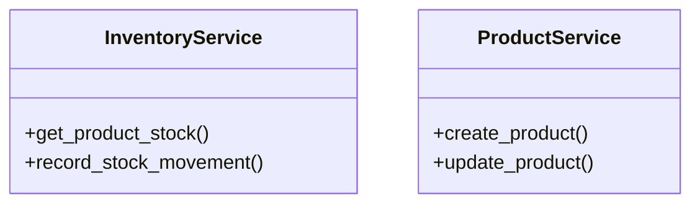

# business_modules.inventory.service_facade

## Imports
- decimal
- django.utils
- models
- services
- services.activity_log.services
- typing

## Classes
- InventoryService
  - method: `get_product_stock`
  - method: `record_stock_movement`
- ProductService
  - method: `create_product`
  - method: `update_product`

## Functions
- get_product_stock
- record_stock_movement
- create_product
- update_product

## Class Diagram

