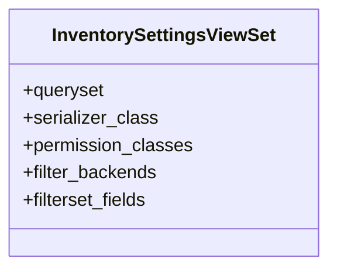

# business_modules.inventory.setting_views

## Imports
- django_filters.rest_framework
- rest_framework
- serializers
- settings_models

## Classes
- InventorySettingsViewSet
  - attr: `queryset`
  - attr: `serializer_class`
  - attr: `permission_classes`
  - attr: `filter_backends`
  - attr: `filterset_fields`

## Class Diagram

