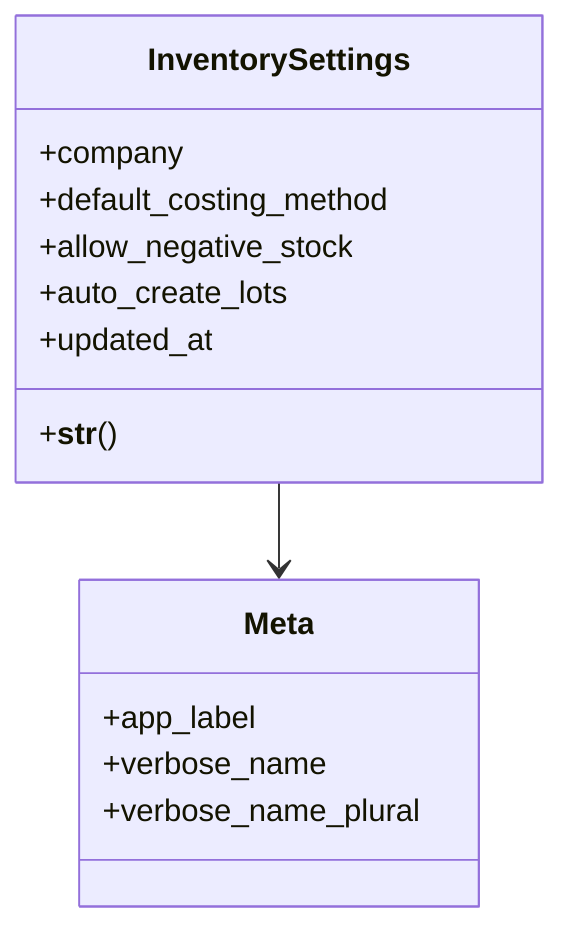

# business_modules.inventory.settings_models

## Imports
- core_modules.organization.models
- django.conf
- django.db
- django.utils.translation

## Classes
- InventorySettings
  - attr: `company`
  - attr: `default_costing_method`
  - attr: `allow_negative_stock`
  - attr: `auto_create_lots`
  - attr: `updated_at`
  - method: `__str__`
- Meta
  - attr: `app_label`
  - attr: `verbose_name`
  - attr: `verbose_name_plural`

## Functions
- __str__

## Class Diagram

