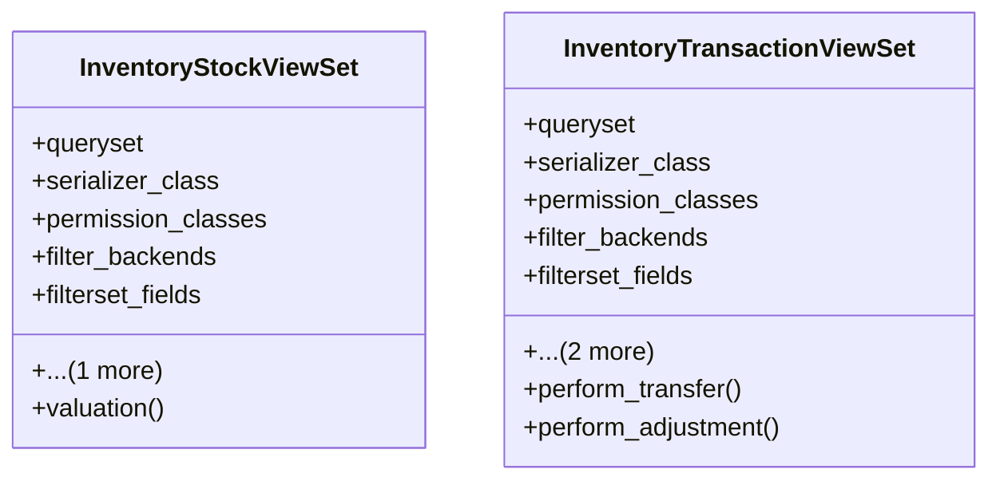

# business_modules.inventory.stock_views

## Imports
- compat
- datetime
- decimal
- django.db
- django.utils.translation
- django_filters.rest_framework
- models
- rest_framework
- rest_framework.decorators
- rest_framework.response
- serializers
- utils

## Classes
- InventoryStockViewSet
  - attr: `queryset`
  - attr: `serializer_class`
  - attr: `permission_classes`
  - attr: `filter_backends`
  - attr: `filterset_fields`
  - attr: `ordering_fields`
  - method: `valuation`
- InventoryTransactionViewSet
  - attr: `queryset`
  - attr: `serializer_class`
  - attr: `permission_classes`
  - attr: `filter_backends`
  - attr: `filterset_fields`
  - attr: `search_fields`
  - attr: `ordering_fields`
  - method: `perform_transfer`
  - method: `perform_adjustment`

## Functions
- valuation
- perform_transfer
- perform_adjustment

## Class Diagram

