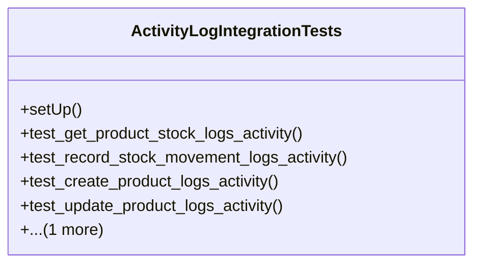

# business_modules.inventory.tests.test_activity_log

## Imports
- datetime
- decimal
- django.test
- models
- service_facade
- tracking
- unittest.mock

## Classes
- ActivityLogIntegrationTests
  - method: `setUp`
  - method: `test_get_product_stock_logs_activity`
  - method: `test_record_stock_movement_logs_activity`
  - method: `test_create_product_logs_activity`
  - method: `test_update_product_logs_activity`
  - method: `test_error_handling_logs_activity`

## Functions
- setUp
- test_get_product_stock_logs_activity
- test_record_stock_movement_logs_activity
- test_create_product_logs_activity
- test_update_product_logs_activity
- test_error_handling_logs_activity

## Class Diagram

