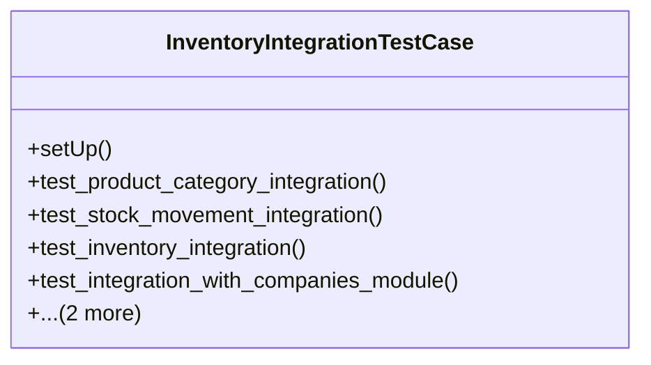

# business_modules.inventory.tests.test_integration

## Imports
- core_modules.accounting.models
- core_modules.companies.models
- core_modules.inventory.models
- core_modules.permissions.models
- core_modules.purchasing.models
- django.db
- django.test
- django.urls
- rest_framework
- rest_framework.test

## Classes
- InventoryIntegrationTestCase
  - method: `setUp`
  - method: `test_product_category_integration`
  - method: `test_stock_movement_integration`
  - method: `test_inventory_integration`
  - method: `test_integration_with_companies_module`
  - method: `test_integration_with_accounting_module`
  - method: `test_integration_with_purchasing_module`

## Functions
- setUp
- test_product_category_integration
- test_stock_movement_integration
- test_inventory_integration
- test_integration_with_companies_module
- test_integration_with_accounting_module
- test_integration_with_purchasing_module

## Class Diagram

