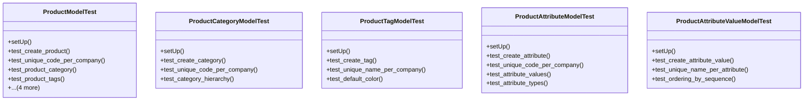

# business_modules.inventory.tests.test_product

## Imports
- core_modules.accounting.models
- core_modules.core.models
- decimal
- django.core.exceptions
- django.db
- django.test
- models.product

## Classes
- ProductModelTest
  - method: `setUp`
  - method: `test_create_product`
  - method: `test_unique_code_per_company`
  - method: `test_product_category`
  - method: `test_product_tags`
  - method: `test_product_attributes`
  - method: `test_product_type`
  - method: `test_get_margin`
  - method: `test_get_profit`
- ProductCategoryModelTest
  - method: `setUp`
  - method: `test_create_category`
  - method: `test_unique_code_per_company`
  - method: `test_category_hierarchy`
- ProductTagModelTest
  - method: `setUp`
  - method: `test_create_tag`
  - method: `test_unique_name_per_company`
  - method: `test_default_color`
- ProductAttributeModelTest
  - method: `setUp`
  - method: `test_create_attribute`
  - method: `test_unique_code_per_company`
  - method: `test_attribute_values`
  - method: `test_attribute_types`
- ProductAttributeValueModelTest
  - method: `setUp`
  - method: `test_create_attribute_value`
  - method: `test_unique_name_per_attribute`
  - method: `test_ordering_by_sequence`

## Functions
- setUp
- test_create_product
- test_unique_code_per_company
- test_product_category
- test_product_tags
- test_product_attributes
- test_product_type
- test_get_margin
- test_get_profit
- setUp
- test_create_category
- test_unique_code_per_company
- test_category_hierarchy
- setUp
- test_create_tag
- test_unique_name_per_company
- test_default_color
- setUp
- test_create_attribute
- test_unique_code_per_company
- test_attribute_values
- test_attribute_types
- setUp
- test_create_attribute_value
- test_unique_name_per_attribute
- test_ordering_by_sequence

## Class Diagram

