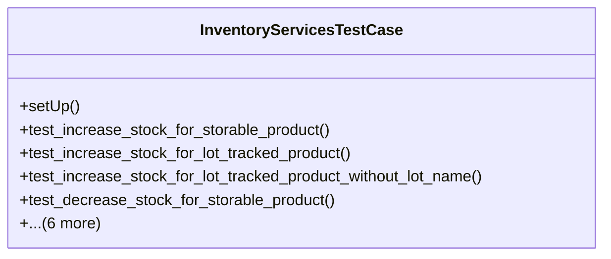

# business_modules.inventory.tests.test_services

## Imports
- business_modules.inventory.models
- business_modules.inventory.services
- datetime
- decimal
- django.contrib.auth.models
- django.test
- django.utils

## Classes
- InventoryServicesTestCase
  - method: `setUp`
  - method: `test_increase_stock_for_storable_product`
  - method: `test_increase_stock_for_lot_tracked_product`
  - method: `test_increase_stock_for_lot_tracked_product_without_lot_name`
  - method: `test_decrease_stock_for_storable_product`
  - method: `test_decrease_stock_insufficient_quantity`
  - method: `test_transfer_stock_between_stores`
  - method: `test_adjust_stock`
  - method: `test_get_stock_level`
  - method: `test_get_stock_level_with_lots`
  - method: `test_perform_stock_count`

## Functions
- setUp
- test_increase_stock_for_storable_product
- test_increase_stock_for_lot_tracked_product
- test_increase_stock_for_lot_tracked_product_without_lot_name
- test_decrease_stock_for_storable_product
- test_decrease_stock_insufficient_quantity
- test_transfer_stock_between_stores
- test_adjust_stock
- test_get_stock_level
- test_get_stock_level_with_lots
- test_perform_stock_count

## Class Diagram

