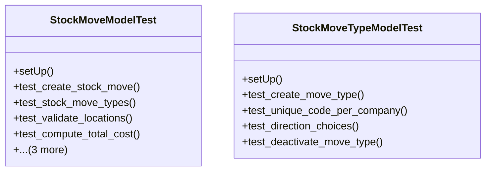

# business_modules.inventory.tests.test_stock_move

## Imports
- core_modules.accounting.models
- core_modules.core.models
- datetime
- decimal
- django.core.exceptions
- django.db
- django.test
- models.product
- models.stock_move
- models.warehouse

## Classes
- StockMoveModelTest
  - method: `setUp`
  - method: `test_create_stock_move`
  - method: `test_stock_move_types`
  - method: `test_validate_locations`
  - method: `test_compute_total_cost`
  - method: `test_stock_move_workflow`
  - method: `test_get_available_quantity`
  - method: `test_get_stock_valuation`
- StockMoveTypeModelTest
  - method: `setUp`
  - method: `test_create_move_type`
  - method: `test_unique_code_per_company`
  - method: `test_direction_choices`
  - method: `test_deactivate_move_type`

## Functions
- setUp
- test_create_stock_move
- test_stock_move_types
- test_validate_locations
- test_compute_total_cost
- test_stock_move_workflow
- test_get_available_quantity
- test_get_stock_valuation
- setUp
- test_create_move_type
- test_unique_code_per_company
- test_direction_choices
- test_deactivate_move_type
- mock_get_available_quantity
- mock_get_stock_valuation

## Class Diagram

