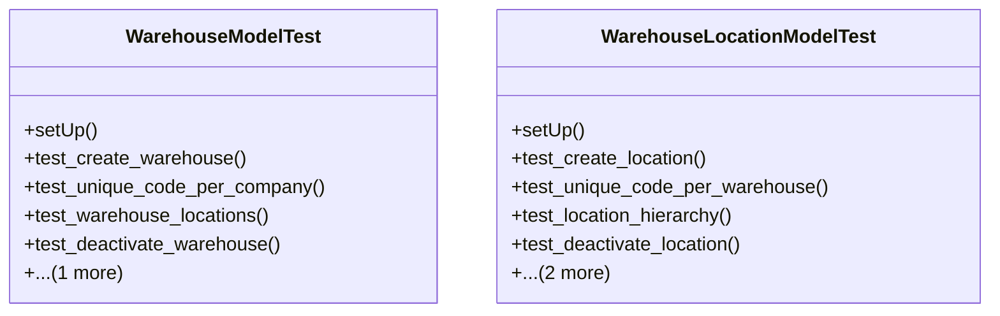

# business_modules.inventory.tests.test_warehouse

## Imports
- core_modules.core.models
- decimal
- django.core.exceptions
- django.db
- django.test
- models.warehouse

## Classes
- WarehouseModelTest
  - method: `setUp`
  - method: `test_create_warehouse`
  - method: `test_unique_code_per_company`
  - method: `test_warehouse_locations`
  - method: `test_deactivate_warehouse`
  - method: `test_get_stock_value`
- WarehouseLocationModelTest
  - method: `setUp`
  - method: `test_create_location`
  - method: `test_unique_code_per_warehouse`
  - method: `test_location_hierarchy`
  - method: `test_deactivate_location`
  - method: `test_get_full_path`
  - method: `test_get_stock_quantity`

## Functions
- setUp
- test_create_warehouse
- test_unique_code_per_company
- test_warehouse_locations
- test_deactivate_warehouse
- test_get_stock_value
- setUp
- test_create_location
- test_unique_code_per_warehouse
- test_location_hierarchy
- test_deactivate_location
- test_get_full_path
- test_get_stock_quantity
- mock_get_stock_value
- mock_get_full_path
- mock_get_stock_quantity

## Class Diagram

