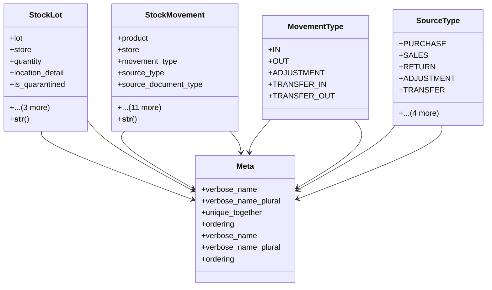

# business_modules.inventory.tracking

## Imports
- __future__
- decimal
- django.conf
- django.db
- django.utils.translation
- models

## Classes
- StockLot
  - attr: `lot`
  - attr: `store`
  - attr: `quantity`
  - attr: `location_detail`
  - attr: `is_quarantined`
  - attr: `quarantine_reason`
  - attr: `created_at`
  - attr: `updated_at`
  - method: `__str__`
- StockMovement
  - attr: `product`
  - attr: `store`
  - attr: `movement_type`
  - attr: `source_type`
  - attr: `source_document_type`
  - attr: `source_document_id`
  - attr: `quantity`
  - attr: `stock_lot`
  - attr: `lot_number`
  - attr: `batch_number`
  - attr: `expiry_date`
  - attr: `unit_cost`
  - attr: `notes`
  - attr: `created_by`
  - attr: `created_at`
  - attr: `updated_at`
  - method: `__str__`
- Meta
  - attr: `verbose_name`
  - attr: `verbose_name_plural`
  - attr: `unique_together`
  - attr: `ordering`
- MovementType
  - attr: `IN`
  - attr: `OUT`
  - attr: `ADJUSTMENT`
  - attr: `TRANSFER_IN`
  - attr: `TRANSFER_OUT`
- SourceType
  - attr: `PURCHASE`
  - attr: `SALES`
  - attr: `RETURN`
  - attr: `ADJUSTMENT`
  - attr: `TRANSFER`
  - attr: `PRODUCTION`
  - attr: `OPENING`
  - attr: `WASTAGE`
  - attr: `OTHER`
- Meta
  - attr: `verbose_name`
  - attr: `verbose_name_plural`
  - attr: `ordering`

## Functions
- __str__
- __str__

## Class Diagram

