# business_modules.inventory.transactions

## Imports
- django.contrib.auth.models
- django.db
- django.utils.translation
- models
- tracking

## Classes
- Site
  - attr: `name`
  - attr: `code`
  - attr: `address`
  - attr: `is_active`
  - attr: `notes`
  - attr: `created_at`
  - attr: `updated_at`
  - method: `__str__`
- StorePermission
  - attr: `ROLE_CHOICES`
  - attr: `store`
  - attr: `user_id`
  - attr: `role`
  - attr: `is_active`
  - attr: `created_at`
  - attr: `updated_at`
  - method: `__str__`
- StockAdjustment
  - attr: `ADJUSTMENT_TYPE_CHOICES`
  - attr: `REASON_CHOICES`
  - attr: `reference`
  - attr: `date`
  - attr: `store`
  - attr: `adjustment_type`
  - attr: `reason`
  - attr: `notes`
  - attr: `created_by`
  - attr: `approved_by`
  - attr: `is_posted`
  - attr: `posted_at`
  - attr: `created_at`
  - attr: `updated_at`
  - method: `__str__`
- StockAdjustmentItem
  - attr: `adjustment`
  - attr: `product`
  - attr: `stock_lot`
  - attr: `lot_number`
  - attr: `batch_number`
  - attr: `expiry_date`
  - attr: `expected_quantity`
  - attr: `actual_quantity`
  - attr: `adjustment_quantity`
  - attr: `unit_cost`
  - attr: `notes`
  - method: `__str__`
- StockTransfer
  - attr: `STATUS_CHOICES`
  - attr: `reference`
  - attr: `date`
  - attr: `source_store`
  - attr: `destination_store`
  - attr: `status`
  - attr: `notes`
  - attr: `created_by`
  - attr: `approved_by`
  - attr: `shipped_by`
  - attr: `received_by`
  - attr: `shipped_date`
  - attr: `received_date`
  - attr: `created_at`
  - attr: `updated_at`
  - method: `__str__`
- StockTransferItem
  - attr: `transfer`
  - attr: `product`
  - attr: `source_stock_lot`
  - attr: `destination_stock_lot`
  - attr: `lot_number`
  - attr: `batch_number`
  - attr: `expiry_date`
  - attr: `quantity`
  - attr: `received_quantity`
  - attr: `unit_cost`
  - attr: `notes`
  - method: `__str__`
- StockCount
  - attr: `STATUS_CHOICES`
  - attr: `reference`
  - attr: `date`
  - attr: `store`
  - attr: `status`
  - attr: `notes`
  - attr: `created_by`
  - attr: `completed_by`
  - attr: `completed_at`
  - attr: `created_at`
  - attr: `updated_at`
  - method: `__str__`
- StockCountItem
  - attr: `count`
  - attr: `product`
  - attr: `stock_lot`
  - attr: `lot_number`
  - attr: `batch_number`
  - attr: `expiry_date`
  - attr: `expected_quantity`
  - attr: `counted_quantity`
  - attr: `variance`
  - attr: `unit_cost`
  - attr: `notes`
  - attr: `counted_by`
  - attr: `counted_at`
  - method: `__str__`
- OpeningStock
  - attr: `reference`
  - attr: `date`
  - attr: `store`
  - attr: `notes`
  - attr: `created_by`
  - attr: `is_posted`
  - attr: `posted_at`
  - attr: `created_at`
  - attr: `updated_at`
  - method: `__str__`
- OpeningStockItem
  - attr: `opening_stock`
  - attr: `product`
  - attr: `lot_number`
  - attr: `batch_number`
  - attr: `expiry_date`
  - attr: `quantity`
  - attr: `unit_cost`
  - attr: `notes`
  - method: `__str__`
- Meta
  - attr: `verbose_name`
  - attr: `verbose_name_plural`
  - attr: `ordering`
- Meta
  - attr: `verbose_name`
  - attr: `verbose_name_plural`
  - attr: `unique_together`
- Meta
  - attr: `verbose_name`
  - attr: `verbose_name_plural`
  - attr: `ordering`
- Meta
  - attr: `verbose_name`
  - attr: `verbose_name_plural`
- Meta
  - attr: `verbose_name`
  - attr: `verbose_name_plural`
  - attr: `ordering`
- Meta
  - attr: `verbose_name`
  - attr: `verbose_name_plural`
- Meta
  - attr: `verbose_name`
  - attr: `verbose_name_plural`
  - attr: `ordering`
- Meta
  - attr: `verbose_name`
  - attr: `verbose_name_plural`
- Meta
  - attr: `verbose_name`
  - attr: `verbose_name_plural`
  - attr: `ordering`
- Meta
  - attr: `verbose_name`
  - attr: `verbose_name_plural`

## Functions
- __str__
- __str__
- __str__
- __str__
- __str__
- __str__
- __str__
- __str__
- __str__
- __str__

## Class Diagram

```mermaid
classDiagram
    class Site {
        +name
        +code
        +address
        +is_active
        +notes
        +... (2 more)
        +__str__()
    }
    class StorePermission {
        +ROLE_CHOICES
        +store
        +user_id
        +role
        +is_active
        +... (2 more)
        +__str__()
    }
    class StockAdjustment {
        +ADJUSTMENT_TYPE_CHOICES
        +REASON_CHOICES
        +reference
        +date
        +store
        +... (9 more)
        +__str__()
    }
    class StockAdjustmentItem {
        +adjustment
        +product
        +stock_lot
        +lot_number
        +batch_number
        +... (6 more)
        +__str__()
    }
    class StockTransfer {
        +STATUS_CHOICES
        +reference
        +date
        +source_store
        +destination_store
        +... (10 more)
        +__str__()
    }
    class StockTransferItem {
        +transfer
        +product
        +source_stock_lot
        +destination_stock_lot
        +lot_number
        +... (6 more)
        +__str__()
    }
    class StockCount {
        +STATUS_CHOICES
        +reference
        +date
        +store
        +status
        +... (6 more)
        +__str__()
    }
    class StockCountItem {
        +count
        +product
        +stock_lot
        +lot_number
        +batch_number
        +... (8 more)
        +__str__()
    }
    class OpeningStock {
        +reference
        +date
        +store
        +notes
        +created_by
        +... (4 more)
        +__str__()
    }
    class OpeningStockItem {
        +opening_stock
        +product
        +lot_number
        +batch_number
        +expiry_date
        +... (3 more)
        +__str__()
    }
    class Meta {
        +verbose_name
        +verbose_name_plural
        +ordering
    }
    class Meta {
        +verbose_name
        +verbose_name_plural
        +unique_together
    }
    class Meta {
        +verbose_name
        +verbose_name_plural
        +ordering
    }
    class Meta {
        +verbose_name
        +verbose_name_plural
    }
    class Meta {
        +verbose_name
        +verbose_name_plural
        +ordering
    }
    class Meta {
        +verbose_name
        +verbose_name_plural
    }
    class Meta {
        +verbose_name
        +verbose_name_plural
        +ordering
    }
    class Meta {
        +verbose_name
        +verbose_name_plural
    }
    class Meta {
        +verbose_name
        +verbose_name_plural
        +ordering
    }
    class Meta {
        +verbose_name
        +verbose_name_plural
    }
    Site --> Meta
    Site --> Meta
    Site --> Meta
    Site --> Meta
    Site --> Meta
    Site --> Meta
    Site --> Meta
    Site --> Meta
    Site --> Meta
    Site --> Meta
    StorePermission --> Meta
    StorePermission --> Meta
    StorePermission --> Meta
    StorePermission --> Meta
    StorePermission --> Meta
    StorePermission --> Meta
    StorePermission --> Meta
    StorePermission --> Meta
    StorePermission --> Meta
    StorePermission --> Meta
    StockAdjustment --> Meta
    StockAdjustment --> Meta
    StockAdjustment --> Meta
    StockAdjustment --> Meta
    StockAdjustment --> Meta
    StockAdjustment --> Meta
    StockAdjustment --> Meta
    StockAdjustment --> Meta
    StockAdjustment --> Meta
    StockAdjustment --> Meta
    StockAdjustmentItem --> Meta
    StockAdjustmentItem --> Meta
    StockAdjustmentItem --> Meta
    StockAdjustmentItem --> Meta
    StockAdjustmentItem --> Meta
    StockAdjustmentItem --> Meta
    StockAdjustmentItem --> Meta
    StockAdjustmentItem --> Meta
    StockAdjustmentItem --> Meta
    StockAdjustmentItem --> Meta
    StockTransfer --> Meta
    StockTransfer --> Meta
    StockTransfer --> Meta
    StockTransfer --> Meta
    StockTransfer --> Meta
    StockTransfer --> Meta
    StockTransfer --> Meta
    StockTransfer --> Meta
    StockTransfer --> Meta
    StockTransfer --> Meta
    StockTransferItem --> Meta
    StockTransferItem --> Meta
    StockTransferItem --> Meta
    StockTransferItem --> Meta
    StockTransferItem --> Meta
    StockTransferItem --> Meta
    StockTransferItem --> Meta
    StockTransferItem --> Meta
    StockTransferItem --> Meta
    StockTransferItem --> Meta
    StockCount --> Meta
    StockCount --> Meta
    StockCount --> Meta
    StockCount --> Meta
    StockCount --> Meta
    StockCount --> Meta
    StockCount --> Meta
    StockCount --> Meta
    StockCount --> Meta
    StockCount --> Meta
    StockCountItem --> Meta
    StockCountItem --> Meta
    StockCountItem --> Meta
    StockCountItem --> Meta
    StockCountItem --> Meta
    StockCountItem --> Meta
    StockCountItem --> Meta
    StockCountItem --> Meta
    StockCountItem --> Meta
    StockCountItem --> Meta
    OpeningStock --> Meta
    OpeningStock --> Meta
    OpeningStock --> Meta
    OpeningStock --> Meta
    OpeningStock --> Meta
    OpeningStock --> Meta
    OpeningStock --> Meta
    OpeningStock --> Meta
    OpeningStock --> Meta
    OpeningStock --> Meta
    OpeningStockItem --> Meta
    OpeningStockItem --> Meta
    OpeningStockItem --> Meta
    OpeningStockItem --> Meta
    OpeningStockItem --> Meta
    OpeningStockItem --> Meta
    OpeningStockItem --> Meta
    OpeningStockItem --> Meta
    OpeningStockItem --> Meta
    OpeningStockItem --> Meta
```

