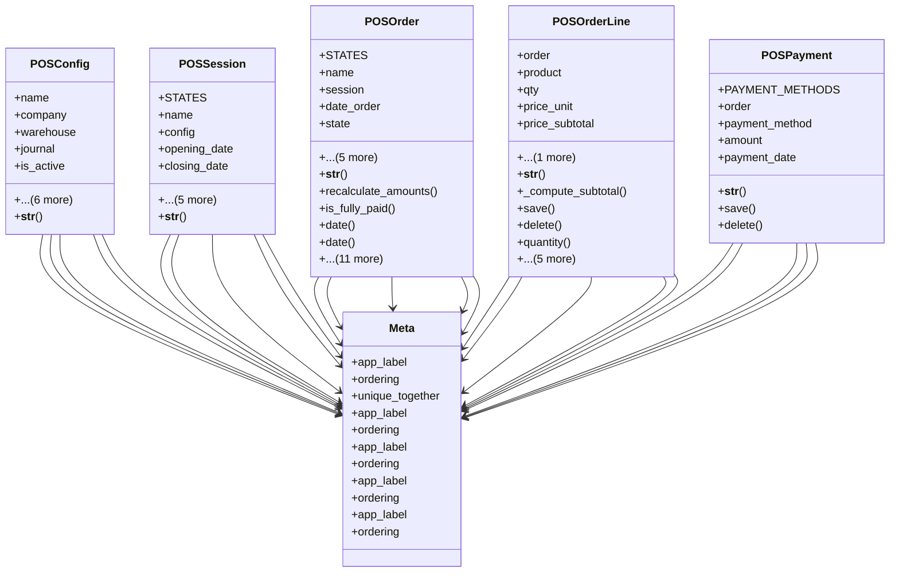

# business_modules.pos.consolidated_models

## Imports
- business_modules.accounting.models
- business_modules.inventory.models
- core_modules.companies.models
- decimal
- django.core.validators
- django.db
- django.utils
- django.utils.translation

## Classes
- POSConfig
  - attr: `name`
  - attr: `company`
  - attr: `warehouse`
  - attr: `journal`
  - attr: `is_active`
  - attr: `allow_discount`
  - attr: `allow_price_change`
  - attr: `allow_credit_sales`
  - attr: `allow_returns`
  - attr: `receipt_header`
  - attr: `receipt_footer`
  - method: `__str__`
- POSSession
  - attr: `STATES`
  - attr: `name`
  - attr: `config`
  - attr: `opening_date`
  - attr: `closing_date`
  - attr: `state`
  - attr: `opening_balance`
  - attr: `closing_balance`
  - attr: `cash_register_balance`
  - attr: `notes`
  - method: `__str__`
- POSOrder
  - attr: `STATES`
  - attr: `name`
  - attr: `session`
  - attr: `date_order`
  - attr: `state`
  - attr: `amount_total`
  - attr: `amount_tax`
  - attr: `amount_paid`
  - attr: `amount_return`
  - attr: `note`
  - method: `__str__`
  - method: `recalculate_amounts`
  - method: `is_fully_paid`
  - method: `date`
  - method: `date`
  - method: `total_amount`
  - method: `total_amount`
  - method: `paid_amount`
  - method: `paid_amount`
  - method: `remaining_amount`
  - method: `remaining_amount`
  - method: `compute_amounts`
  - method: `compute_paid_amount`
  - method: `action_confirm`
  - method: `action_done`
  - method: `action_cancel`
- POSOrderLine
  - attr: `order`
  - attr: `product`
  - attr: `qty`
  - attr: `price_unit`
  - attr: `price_subtotal`
  - attr: `discount`
  - method: `__str__`
  - method: `_compute_subtotal`
  - method: `save`
  - method: `delete`
  - method: `quantity`
  - method: `quantity`
  - method: `unit_price`
  - method: `unit_price`
  - method: `subtotal`
  - method: `subtotal`
- POSPayment
  - attr: `PAYMENT_METHODS`
  - attr: `order`
  - attr: `payment_method`
  - attr: `amount`
  - attr: `payment_date`
  - method: `__str__`
  - method: `save`
  - method: `delete`
- Meta
  - attr: `app_label`
  - attr: `ordering`
  - attr: `unique_together`
- Meta
  - attr: `app_label`
  - attr: `ordering`
- Meta
  - attr: `app_label`
  - attr: `ordering`
- Meta
  - attr: `app_label`
  - attr: `ordering`
- Meta
  - attr: `app_label`
  - attr: `ordering`

## Functions
- __str__
- __str__
- __str__
- recalculate_amounts
- is_fully_paid
- date
- date
- total_amount
- total_amount
- paid_amount
- paid_amount
- remaining_amount
- remaining_amount
- compute_amounts
- compute_paid_amount
- action_confirm
- action_done
- action_cancel
- __str__
- _compute_subtotal
- save
- delete
- quantity
- quantity
- unit_price
- unit_price
- subtotal
- subtotal
- __str__
- save
- delete

## Class Diagram

