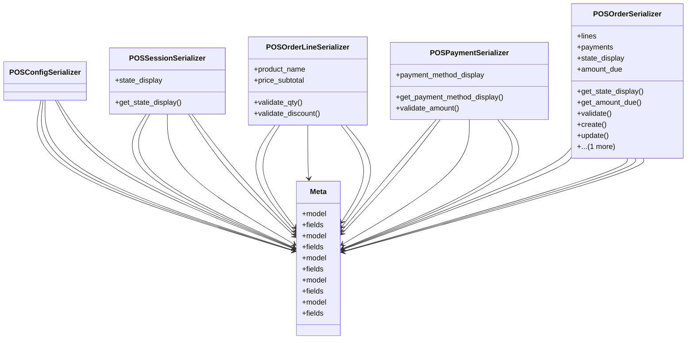

# business_modules.pos.serializers

## Imports
- decimal
- django.db
- django.db.models
- django.utils.translation
- models
- rest_framework

## Classes
- POSConfigSerializer
- POSSessionSerializer
  - attr: `state_display`
  - method: `get_state_display`
- POSOrderLineSerializer
  - attr: `product_name`
  - attr: `price_subtotal`
  - method: `validate_qty`
  - method: `validate_discount`
- POSPaymentSerializer
  - attr: `payment_method_display`
  - method: `get_payment_method_display`
  - method: `validate_amount`
- POSOrderSerializer
  - attr: `lines`
  - attr: `payments`
  - attr: `state_display`
  - attr: `amount_due`
  - method: `get_state_display`
  - method: `get_amount_due`
  - method: `validate`
  - method: `create`
  - method: `update`
  - method: `_recalculate_order_totals`
- Meta
  - attr: `model`
  - attr: `fields`
- Meta
  - attr: `model`
  - attr: `fields`
- Meta
  - attr: `model`
  - attr: `fields`
- Meta
  - attr: `model`
  - attr: `fields`
- Meta
  - attr: `model`
  - attr: `fields`

## Functions
- get_state_display
- validate_qty
- validate_discount
- get_payment_method_display
- validate_amount
- get_state_display
- get_amount_due
- validate
- create
- update
- _recalculate_order_totals

## Class Diagram

