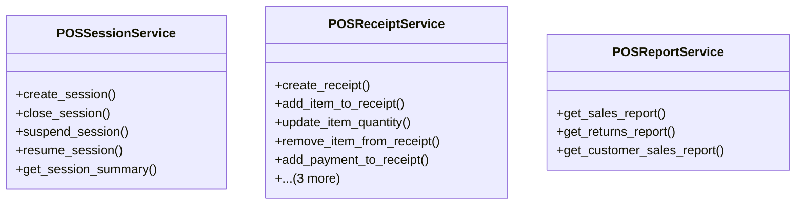

# business_modules.pos.services

## Imports
- business_modules.contacts.models
- business_modules.inventory.services
- business_modules.pos.models
- decimal
- django.core.exceptions
- django.db
- django.db.models
- django.utils
- django.utils.translation

## Classes
- POSSessionService
  - method: `create_session`
  - method: `close_session`
  - method: `suspend_session`
  - method: `resume_session`
  - method: `get_session_summary`
- POSReceiptService
  - method: `create_receipt`
  - method: `add_item_to_receipt`
  - method: `update_item_quantity`
  - method: `remove_item_from_receipt`
  - method: `add_payment_to_receipt`
  - method: `confirm_receipt`
  - method: `cancel_receipt`
  - method: `process_return`
- POSReportService
  - method: `get_sales_report`
  - method: `get_returns_report`
  - method: `get_customer_sales_report`

## Functions
- create_session
- close_session
- suspend_session
- resume_session
- get_session_summary
- create_receipt
- add_item_to_receipt
- update_item_quantity
- remove_item_from_receipt
- add_payment_to_receipt
- confirm_receipt
- cancel_receipt
- process_return
- get_sales_report
- get_returns_report
- get_customer_sales_report

## Class Diagram

