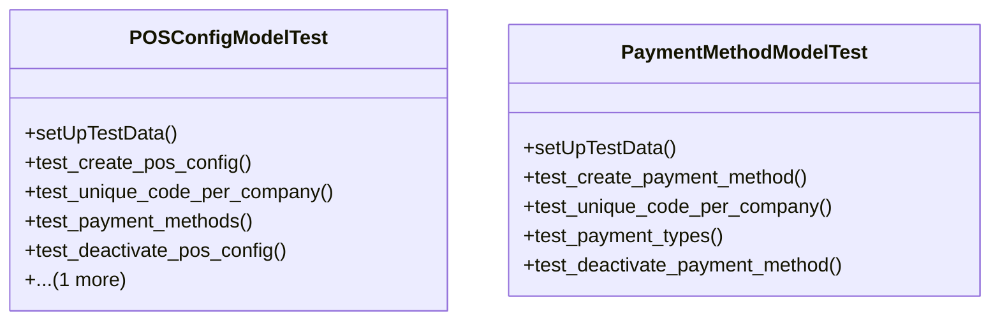

# business_modules.pos.tests.test_pos_config

## Imports
- django.core.exceptions
- django.db
- django.test
- models.pos_config
- services_modules.accounting.models
- services_modules.core.models
- services_modules.inventory.models

## Classes
- POSConfigModelTest
  - method: `setUpTestData`
  - method: `test_create_pos_config`
  - method: `test_unique_code_per_company`
  - method: `test_payment_methods`
  - method: `test_deactivate_pos_config`
  - method: `test_pos_config_permissions`
- PaymentMethodModelTest
  - method: `setUpTestData`
  - method: `test_create_payment_method`
  - method: `test_unique_code_per_company`
  - method: `test_payment_types`
  - method: `test_deactivate_payment_method`

## Functions
- setUpTestData
- test_create_pos_config
- test_unique_code_per_company
- test_payment_methods
- test_deactivate_pos_config
- test_pos_config_permissions
- setUpTestData
- test_create_payment_method
- test_unique_code_per_company
- test_payment_types
- test_deactivate_payment_method

## Class Diagram

