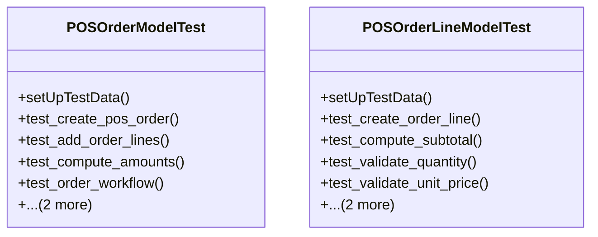

# business_modules.pos.tests.test_pos_order

## Imports
- decimal
- django.core.exceptions
- django.test
- django.utils
- models.pos_config
- models.pos_order
- models.pos_payment
- models.pos_session
- services_modules.accounting.models
- services_modules.core.models
- services_modules.inventory.models

## Classes
- POSOrderModelTest
  - method: `setUpTestData`
  - method: `test_create_pos_order`
  - method: `test_add_order_lines`
  - method: `test_compute_amounts`
  - method: `test_order_workflow`
  - method: `test_validate_payment_amount`
  - method: `test_get_order_summary`
- POSOrderLineModelTest
  - method: `setUpTestData`
  - method: `test_create_order_line`
  - method: `test_compute_subtotal`
  - method: `test_validate_quantity`
  - method: `test_validate_unit_price`
  - method: `test_validate_discount`
  - method: `test_get_cost_amount`

## Functions
- setUpTestData
- test_create_pos_order
- test_add_order_lines
- test_compute_amounts
- test_order_workflow
- test_validate_payment_amount
- test_get_order_summary
- setUpTestData
- test_create_order_line
- test_compute_subtotal
- test_validate_quantity
- test_validate_unit_price
- test_validate_discount
- test_get_cost_amount
- mock_get_order_summary
- mock_get_cost_amount

## Class Diagram

