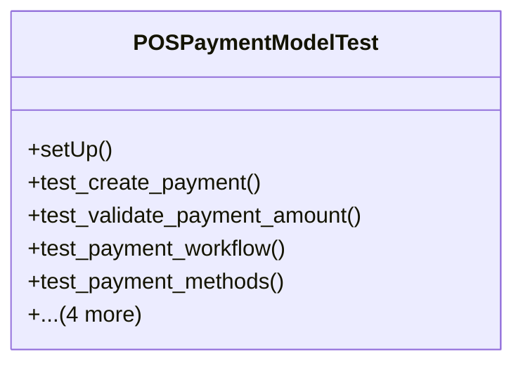

# business_modules.pos.tests.test_pos_payment

## Imports
- decimal
- django.core.exceptions
- django.test
- django.utils
- models.pos_config
- models.pos_order
- models.pos_payment
- models.pos_session
- services_modules.accounting.models
- services_modules.core.models
- services_modules.inventory.models

## Classes
- POSPaymentModelTest
  - method: `setUp`
  - method: `test_create_payment`
  - method: `test_validate_payment_amount`
  - method: `test_payment_workflow`
  - method: `test_payment_methods`
  - method: `test_get_payment_journal_entry`
  - method: `test_validate_payment_method`
  - method: `test_total_payments`
  - method: `test_get_payment_by_method`

## Functions
- setUp
- test_create_payment
- test_validate_payment_amount
- test_payment_workflow
- test_payment_methods
- test_get_payment_journal_entry
- test_validate_payment_method
- test_total_payments
- test_get_payment_by_method
- mock_get_journal_entry
- mock_get_total_payments
- mock_get_payments_by_method

## Class Diagram

