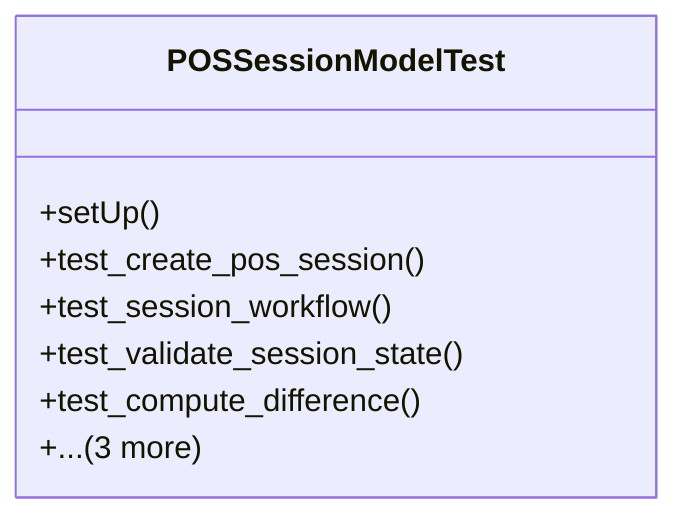

# business_modules.pos.tests.test_pos_session

## Imports
- decimal
- django.core.exceptions
- django.test
- django.utils
- models.pos_config
- models.pos_session
- services_modules.accounting.models
- services_modules.core.models
- services_modules.inventory.models

## Classes
- POSSessionModelTest
  - method: `setUp`
  - method: `test_create_pos_session`
  - method: `test_session_workflow`
  - method: `test_validate_session_state`
  - method: `test_compute_difference`
  - method: `test_get_total_sales`
  - method: `test_get_payment_summary`
  - method: `test_validate_closing_balance`

## Functions
- setUp
- test_create_pos_session
- test_session_workflow
- test_validate_session_state
- test_compute_difference
- test_get_total_sales
- test_get_payment_summary
- test_validate_closing_balance
- mock_get_total_sales
- mock_get_payment_summary

## Class Diagram

