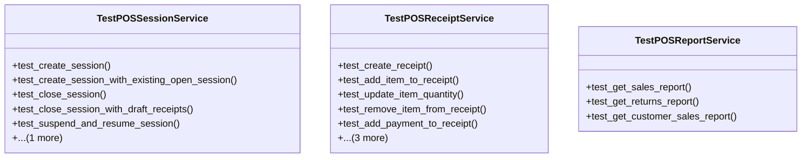

# business_modules.pos.tests.test_services

## Imports
- business_modules.contacts.models
- business_modules.inventory.models
- business_modules.pos.models
- business_modules.pos.services
- decimal
- django.contrib.auth
- django.core.exceptions
- django.utils
- organization.models
- pytest

## Classes
- TestPOSSessionService
  - method: `test_create_session`
  - method: `test_create_session_with_existing_open_session`
  - method: `test_close_session`
  - method: `test_close_session_with_draft_receipts`
  - method: `test_suspend_and_resume_session`
  - method: `test_get_session_summary`
- TestPOSReceiptService
  - method: `test_create_receipt`
  - method: `test_add_item_to_receipt`
  - method: `test_update_item_quantity`
  - method: `test_remove_item_from_receipt`
  - method: `test_add_payment_to_receipt`
  - method: `test_confirm_receipt`
  - method: `test_cancel_receipt`
  - method: `test_process_return`
- TestPOSReportService
  - method: `test_get_sales_report`
  - method: `test_get_returns_report`
  - method: `test_get_customer_sales_report`

## Functions
- test_user
- test_branch
- test_store
- test_customer
- test_product
- test_payment_method
- test_session
- test_receipt
- test_receipt_item
- test_payment
- test_create_session
- test_create_session_with_existing_open_session
- test_close_session
- test_close_session_with_draft_receipts
- test_suspend_and_resume_session
- test_get_session_summary
- test_create_receipt
- test_add_item_to_receipt
- test_update_item_quantity
- test_remove_item_from_receipt
- test_add_payment_to_receipt
- test_confirm_receipt
- test_cancel_receipt
- test_process_return
- test_get_sales_report
- test_get_returns_report
- test_get_customer_sales_report

## Module Variables
- `User`

## Class Diagram

