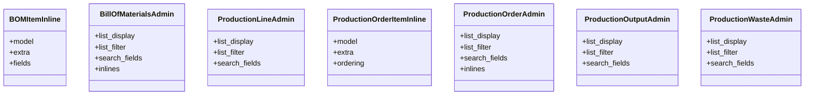

# business_modules.production.admin

## Imports
- django.contrib
- django.utils.translation
- models

## Classes
- BOMItemInline
  - attr: `model`
  - attr: `extra`
  - attr: `fields`
- BillOfMaterialsAdmin
  - attr: `list_display`
  - attr: `list_filter`
  - attr: `search_fields`
  - attr: `inlines`
- ProductionLineAdmin
  - attr: `list_display`
  - attr: `list_filter`
  - attr: `search_fields`
- ProductionOrderItemInline
  - attr: `model`
  - attr: `extra`
  - attr: `ordering`
- ProductionOrderAdmin
  - attr: `list_display`
  - attr: `list_filter`
  - attr: `search_fields`
  - attr: `inlines`
- ProductionOutputAdmin
  - attr: `list_display`
  - attr: `list_filter`
  - attr: `search_fields`
- ProductionWasteAdmin
  - attr: `list_display`
  - attr: `list_filter`
  - attr: `search_fields`

## Class Diagram

