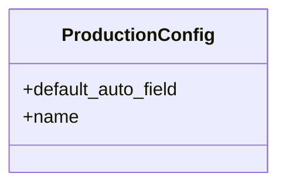

# business_modules.production.apps

## Imports
- django.apps

## Classes
- ProductionConfig
  - attr: `default_auto_field`
  - attr: `name`

## Class Diagram

```mermaid
classDiagram
    class ProductionConfig {
        +default_auto_field
        +name
    }
```
