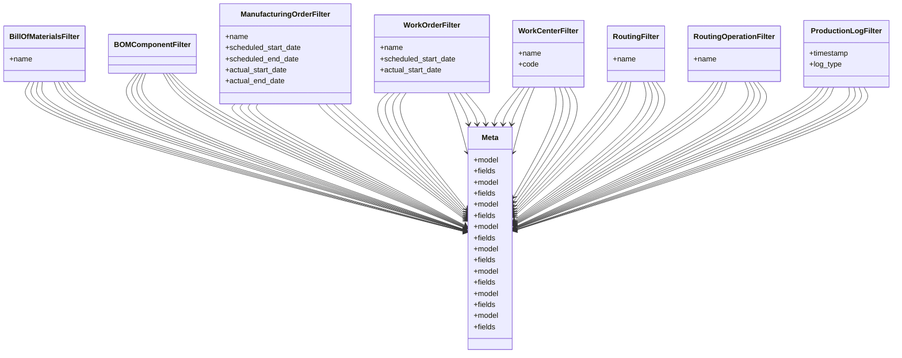

# business_modules.production.filters

## Imports
- django.db
- django_filters
- models

## Classes
- BillOfMaterialsFilter
  - attr: `name`
- BOMComponentFilter
- ManufacturingOrderFilter
  - attr: `name`
  - attr: `scheduled_start_date`
  - attr: `scheduled_end_date`
  - attr: `actual_start_date`
  - attr: `actual_end_date`
- WorkOrderFilter
  - attr: `name`
  - attr: `scheduled_start_date`
  - attr: `actual_start_date`
- WorkCenterFilter
  - attr: `name`
  - attr: `code`
- RoutingFilter
  - attr: `name`
- RoutingOperationFilter
  - attr: `name`
- ProductionLogFilter
  - attr: `timestamp`
  - attr: `log_type`
- Meta
  - attr: `model`
  - attr: `fields`
- Meta
  - attr: `model`
  - attr: `fields`
- Meta
  - attr: `model`
  - attr: `fields`
- Meta
  - attr: `model`
  - attr: `fields`
- Meta
  - attr: `model`
  - attr: `fields`
- Meta
  - attr: `model`
  - attr: `fields`
- Meta
  - attr: `model`
  - attr: `fields`
- Meta
  - attr: `model`
  - attr: `fields`

## Class Diagram

