# business_modules.production.merged.admin

## Imports
- django.contrib
- django.db
- django.utils.translation
- models

## Classes
- ProductionOperationInline
  - attr: `model`
  - attr: `extra`
  - attr: `fields`
- ProductionBatchInline
  - attr: `model`
  - attr: `extra`
  - attr: `fields`
  - attr: `readonly_fields`
- ProductionOrderAdmin
  - attr: `list_display`
  - attr: `list_filter`
  - attr: `search_fields`
  - attr: `readonly_fields`
  - attr: `fieldsets`
  - attr: `inlines`
  - method: `save_model`
- QualityTestInline
  - attr: `model`
  - attr: `extra`
  - attr: `fields`
- ProductionBatchAdmin
  - attr: `list_display`
  - attr: `list_filter`
  - attr: `search_fields`
  - attr: `readonly_fields`
  - attr: `fieldsets`
  - attr: `inlines`
  - method: `save_model`
- QualityTestAdmin
  - attr: `list_display`
  - attr: `list_filter`
  - attr: `search_fields`
  - attr: `readonly_fields`
  - attr: `fieldsets`
- BOMComponentInline
  - attr: `model`
  - attr: `extra`
  - attr: `fields`
- BillOfMaterialsAdmin
  - attr: `list_display`
  - attr: `list_filter`
  - attr: `search_fields`
  - attr: `readonly_fields`
  - attr: `fieldsets`
  - attr: `inlines`
- WorkCenterAdmin
  - attr: `list_display`
  - attr: `list_filter`
  - attr: `search_fields`
  - attr: `readonly_fields`
  - attr: `fieldsets`
- RoutingOperationInline
  - attr: `model`
  - attr: `extra`
  - attr: `fields`
- RoutingAdmin
  - attr: `list_display`
  - attr: `search_fields`
  - attr: `readonly_fields`
  - attr: `fieldsets`
  - attr: `inlines`
- WorkOrderInline
  - attr: `model`
  - attr: `extra`
  - attr: `fields`
  - attr: `readonly_fields`
- ProductionLogInline
  - attr: `model`
  - attr: `extra`
  - attr: `fields`
  - attr: `readonly_fields`
- ManufacturingOrderAdmin
  - attr: `list_display`
  - attr: `list_filter`
  - attr: `search_fields`
  - attr: `readonly_fields`
  - attr: `fieldsets`
  - attr: `inlines`
- WorkOrderAdmin
  - attr: `list_display`
  - attr: `list_filter`
  - attr: `search_fields`
  - attr: `readonly_fields`
  - attr: `fieldsets`
  - attr: `inlines`
- ProductionLogAdmin
  - attr: `list_display`
  - attr: `list_filter`
  - attr: `search_fields`
  - attr: `readonly_fields`
  - attr: `fieldsets`

## Functions
- save_model
- save_model

## Class Diagram

```mermaid
classDiagram
    class ProductionOperationInline {
        +model
        +extra
        +fields
    }
    class ProductionBatchInline {
        +model
        +extra
        +fields
        +readonly_fields
    }
    class ProductionOrderAdmin {
        +list_display
        +list_filter
        +search_fields
        +readonly_fields
        +fieldsets
        +... (1 more)
        +save_model()
    }
    class QualityTestInline {
        +model
        +extra
        +fields
    }
    class ProductionBatchAdmin {
        +list_display
        +list_filter
        +search_fields
        +readonly_fields
        +fieldsets
        +... (1 more)
        +save_model()
    }
    class QualityTestAdmin {
        +list_display
        +list_filter
        +search_fields
        +readonly_fields
        +fieldsets
    }
    class BOMComponentInline {
        +model
        +extra
        +fields
    }
    class BillOfMaterialsAdmin {
        +list_display
        +list_filter
        +search_fields
        +readonly_fields
        +fieldsets
        +... (1 more)
    }
    class WorkCenterAdmin {
        +list_display
        +list_filter
        +search_fields
        +readonly_fields
        +fieldsets
    }
    class RoutingOperationInline {
        +model
        +extra
        +fields
    }
    class RoutingAdmin {
        +list_display
        +search_fields
        +readonly_fields
        +fieldsets
        +inlines
    }
    class WorkOrderInline {
        +model
        +extra
        +fields
        +readonly_fields
    }
    class ProductionLogInline {
        +model
        +extra
        +fields
        +readonly_fields
    }
    class ManufacturingOrderAdmin {
        +list_display
        +list_filter
        +search_fields
        +readonly_fields
        +fieldsets
        +... (1 more)
    }
    class WorkOrderAdmin {
        +list_display
        +list_filter
        +search_fields
        +readonly_fields
        +fieldsets
        +... (1 more)
    }
    class ProductionLogAdmin {
        +list_display
        +list_filter
        +search_fields
        +readonly_fields
        +fieldsets
    }
```

