# business_modules.production.merged.models

## Imports
- __future__
- decimal
- django.conf
- django.db
- django.utils.translation

## Classes
- ProductionSource
  - attr: `INTERNAL`
  - attr: `EXTERNAL`
  - attr: `MIXED`
- ProductType
  - attr: `SEED`
  - attr: `VEGETABLE`
  - attr: `FRUIT`
  - attr: `OTHER`
- ProductionOrderStatus
  - attr: `DRAFT`
  - attr: `CONFIRMED`
  - attr: `IN_PROGRESS`
  - attr: `COMPLETED`
  - attr: `CANCELLED`
  - attr: `TO_CLOSE`
  - attr: `DONE`
- OperationType
  - attr: `SEED_SORTING`
  - attr: `SEED_DRYING`
  - attr: `SEED_CLEANING`
  - attr: `SEED_TREATMENT`
  - attr: `SEED_TESTING`
  - attr: `SEED_PACKAGING`
  - attr: `SEED_LABELING`
  - attr: `INITIAL_SORTING`
  - attr: `MANUAL_SORTING`
  - attr: `MECHANICAL_SORTING`
  - attr: `WASHING`
  - attr: `PACKAGING`
  - attr: `REFRIGERATION`
  - attr: `FREEZING`
  - attr: `PALLETIZING`
  - attr: `QUALITY_CONTROL`
- ProductGrade
  - attr: `PREMIUM`
  - attr: `GRADE_1`
  - attr: `GRADE_1_5`
  - attr: `GRADE_2`
  - attr: `GRADE_3`
  - attr: `SORTING`
- ProductionOrder
  - attr: `order_number`
  - attr: `product_type`
  - attr: `product`
  - attr: `source`
  - attr: `supplier_name`
  - attr: `farm`
  - attr: `seed_production_batch_id`
  - attr: `planned_start_date`
  - attr: `actual_start_date`
  - attr: `planned_end_date`
  - attr: `actual_end_date`
  - attr: `input_quantity`
  - attr: `input_unit`
  - attr: `expected_output_quantity`
  - attr: `actual_output_quantity`
  - attr: `output_unit`
  - attr: `status`
  - attr: `notes`
  - attr: `created_by`
  - attr: `created_at`
  - attr: `updated_by`
  - attr: `updated_at`
  - method: `__str__`
  - method: `calculate_waste_percentage`
  - method: `calculate_profit`
  - method: `calculate_total_cost`
  - method: `get_input_unit_cost`
  - method: `get_purchase_price`
  - method: `get_farm_production_cost`
  - method: `get_seed_production_cost`
- ProductionOperation
  - attr: `production_order`
  - attr: `operation_type`
  - attr: `sequence`
  - attr: `planned_start_date`
  - attr: `actual_start_date`
  - attr: `planned_end_date`
  - attr: `actual_end_date`
  - attr: `input_quantity`
  - attr: `output_quantity`
  - attr: `waste_quantity`
  - attr: `status`
  - attr: `notes`
  - attr: `labor_cost`
  - attr: `equipment_cost`
  - attr: `material_cost`
  - attr: `responsible`
  - attr: `created_by`
  - attr: `created_at`
  - attr: `updated_by`
  - attr: `updated_at`
  - method: `__str__`
  - method: `calculate_waste_percentage`
  - method: `calculate_cost`
- ProductionBatch
  - attr: `production_order`
  - attr: `batch_number`
  - attr: `lot_number`
  - attr: `product_name`
  - attr: `grade`
  - attr: `size`
  - attr: `quantity`
  - attr: `unit`
  - attr: `unit_price`
  - attr: `total_value`
  - attr: `production_date`
  - attr: `expiry_date`
  - attr: `notes`
  - attr: `created_by`
  - attr: `created_at`
  - attr: `updated_by`
  - attr: `updated_at`
  - method: `__str__`
  - method: `save`
  - method: `calculate_value`
- QualityTest
  - attr: `production_batch`
  - attr: `test_type`
  - attr: `test_date`
  - attr: `result`
  - attr: `passed`
  - attr: `tester`
  - attr: `notes`
  - attr: `created_at`
  - attr: `updated_at`
  - method: `__str__`
- BillOfMaterials
  - attr: `name`
  - attr: `product_to_produce`
  - attr: `product_variant_to_produce`
  - attr: `quantity`
  - attr: `unit_of_measure`
  - attr: `is_active`
  - attr: `notes`
  - attr: `created_at`
  - attr: `updated_at`
  - attr: `created_by`
  - attr: `updated_by`
  - method: `__str__`
- BOMComponent
  - attr: `bom`
  - attr: `component_product_variant`
  - attr: `quantity`
  - attr: `unit_of_measure`
  - attr: `scrap_factor`
  - attr: `operation`
  - attr: `notes`
  - method: `__str__`
- WorkCenter
  - attr: `name`
  - attr: `code`
  - attr: `capacity_hours_per_day`
  - attr: `time_efficiency`
  - attr: `oee_target`
  - attr: `setup_time`
  - attr: `cleanup_time`
  - attr: `cost_per_hour`
  - attr: `notes`
  - attr: `created_at`
  - attr: `updated_at`
  - method: `__str__`
- Routing
  - attr: `name`
  - attr: `bom`
  - attr: `notes`
  - attr: `created_at`
  - attr: `updated_at`
  - method: `__str__`
- RoutingOperation
  - attr: `routing`
  - attr: `name`
  - attr: `sequence`
  - attr: `work_center`
  - attr: `setup_time`
  - attr: `duration_per_unit`
  - attr: `instructions`
  - method: `__str__`
- ManufacturingOrder
  - attr: `name`
  - attr: `product_to_produce`
  - attr: `product_variant_to_produce`
  - attr: `bom`
  - attr: `routing`
  - attr: `quantity_to_produce`
  - attr: `quantity_produced`
  - attr: `unit_of_measure`
  - attr: `scheduled_start_date`
  - attr: `scheduled_end_date`
  - attr: `actual_start_date`
  - attr: `actual_end_date`
  - attr: `status`
  - attr: `responsible_user`
  - attr: `source_document`
  - attr: `notes`
  - attr: `created_at`
  - attr: `updated_at`
  - method: `__str__`
- WorkOrder
  - attr: `name`
  - attr: `manufacturing_order`
  - attr: `routing_operation`
  - attr: `work_center`
  - attr: `quantity_to_produce`
  - attr: `quantity_produced`
  - attr: `quantity_scrapped`
  - attr: `scheduled_start_date`
  - attr: `scheduled_duration_hours`
  - attr: `actual_start_date`
  - attr: `actual_duration_hours`
  - attr: `status`
  - attr: `notes`
  - attr: `created_at`
  - attr: `updated_at`
  - method: `__str__`
- ProductionLog
  - attr: `manufacturing_order`
  - attr: `work_order`
  - attr: `log_type`
  - attr: `timestamp`
  - attr: `logged_by`
  - attr: `description`
  - attr: `quantity`
  - attr: `product`
  - attr: `unit_of_measure`
  - attr: `duration_hours`
  - method: `__str__`
- Meta
  - attr: `app_label`
  - attr: `verbose_name`
  - attr: `verbose_name_plural`
  - attr: `ordering`
- Meta
  - attr: `app_label`
  - attr: `verbose_name`
  - attr: `verbose_name_plural`
  - attr: `ordering`
  - attr: `unique_together`
- Meta
  - attr: `app_label`
  - attr: `verbose_name`
  - attr: `verbose_name_plural`
  - attr: `ordering`
- Meta
  - attr: `app_label`
  - attr: `verbose_name`
  - attr: `verbose_name_plural`
  - attr: `ordering`
- Meta
  - attr: `app_label`
  - attr: `verbose_name`
  - attr: `verbose_name_plural`
  - attr: `ordering`
- Meta
  - attr: `app_label`
  - attr: `verbose_name`
  - attr: `verbose_name_plural`
  - attr: `unique_together`
- Meta
  - attr: `app_label`
  - attr: `verbose_name`
  - attr: `verbose_name_plural`
  - attr: `ordering`
- Meta
  - attr: `app_label`
  - attr: `verbose_name`
  - attr: `verbose_name_plural`
  - attr: `ordering`
- Meta
  - attr: `app_label`
  - attr: `verbose_name`
  - attr: `verbose_name_plural`
  - attr: `ordering`
  - attr: `unique_together`
- Status
  - attr: `DRAFT`
  - attr: `CONFIRMED`
  - attr: `PLANNED`
  - attr: `IN_PROGRESS`
  - attr: `TO_CLOSE`
  - attr: `DONE`
  - attr: `CANCELLED`
- Meta
  - attr: `app_label`
  - attr: `verbose_name`
  - attr: `verbose_name_plural`
  - attr: `ordering`
- Status
  - attr: `PENDING`
  - attr: `READY`
  - attr: `IN_PROGRESS`
  - attr: `PAUSED`
  - attr: `DONE`
  - attr: `CANCELLED`
- Meta
  - attr: `app_label`
  - attr: `verbose_name`
  - attr: `verbose_name_plural`
  - attr: `ordering`
- LogType
  - attr: `NOTE`
  - attr: `PRODUCTION`
  - attr: `CONSUMPTION`
  - attr: `SCRAP`
  - attr: `QUALITY`
  - attr: `TIME`
  - attr: `OTHER`
- Meta
  - attr: `app_label`
  - attr: `verbose_name`
  - attr: `verbose_name_plural`
  - attr: `ordering`

## Functions
- __str__
- calculate_waste_percentage
- calculate_profit
- calculate_total_cost
- get_input_unit_cost
- get_purchase_price
- get_farm_production_cost
- get_seed_production_cost
- __str__
- calculate_waste_percentage
- calculate_cost
- __str__
- save
- calculate_value
- __str__
- __str__
- __str__
- __str__
- __str__
- __str__
- __str__
- __str__
- __str__

## Class Diagram

```mermaid
classDiagram
    class ProductionSource {
        +INTERNAL
        +EXTERNAL
        +MIXED
    }
    class ProductType {
        +SEED
        +VEGETABLE
        +FRUIT
        +OTHER
    }
    class ProductionOrderStatus {
        +DRAFT
        +CONFIRMED
        +IN_PROGRESS
        +COMPLETED
        +CANCELLED
        +... (2 more)
    }
    class OperationType {
        +SEED_SORTING
        +SEED_DRYING
        +SEED_CLEANING
        +SEED_TREATMENT
        +SEED_TESTING
        +... (11 more)
    }
    class ProductGrade {
        +PREMIUM
        +GRADE_1
        +GRADE_1_5
        +GRADE_2
        +GRADE_3
        +... (1 more)
    }
    class ProductionOrder {
        +order_number
        +product_type
        +product
        +source
        +supplier_name
        +... (17 more)
        +__str__()
        +calculate_waste_percentage()
        +calculate_profit()
        +calculate_total_cost()
        +get_input_unit_cost()
        +... (3 more)
    }
    class ProductionOperation {
        +production_order
        +operation_type
        +sequence
        +planned_start_date
        +actual_start_date
        +... (15 more)
        +__str__()
        +calculate_waste_percentage()
        +calculate_cost()
    }
    class ProductionBatch {
        +production_order
        +batch_number
        +lot_number
        +product_name
        +grade
        +... (12 more)
        +__str__()
        +save()
        +calculate_value()
    }
    class QualityTest {
        +production_batch
        +test_type
        +test_date
        +result
        +passed
        +... (4 more)
        +__str__()
    }
    class BillOfMaterials {
        +name
        +product_to_produce
        +product_variant_to_produce
        +quantity
        +unit_of_measure
        +... (6 more)
        +__str__()
    }
    class BOMComponent {
        +bom
        +component_product_variant
        +quantity
        +unit_of_measure
        +scrap_factor
        +... (2 more)
        +__str__()
    }
    class WorkCenter {
        +name
        +code
        +capacity_hours_per_day
        +time_efficiency
        +oee_target
        +... (6 more)
        +__str__()
    }
    class Routing {
        +name
        +bom
        +notes
        +created_at
        +updated_at
        +__str__()
    }
    class RoutingOperation {
        +routing
        +name
        +sequence
        +work_center
        +setup_time
        +... (2 more)
        +__str__()
    }
    class ManufacturingOrder {
        +name
        +product_to_produce
        +product_variant_to_produce
        +bom
        +routing
        +... (13 more)
        +__str__()
    }
    class WorkOrder {
        +name
        +manufacturing_order
        +routing_operation
        +work_center
        +quantity_to_produce
        +... (10 more)
        +__str__()
    }
    class ProductionLog {
        +manufacturing_order
        +work_order
        +log_type
        +timestamp
        +logged_by
        +... (5 more)
        +__str__()
    }
    class Meta {
        +app_label
        +verbose_name
        +verbose_name_plural
        +ordering
    }
    class Meta {
        +app_label
        +verbose_name
        +verbose_name_plural
        +ordering
        +unique_together
    }
    class Meta {
        +app_label
        +verbose_name
        +verbose_name_plural
        +ordering
    }
    class Meta {
        +app_label
        +verbose_name
        +verbose_name_plural
        +ordering
    }
    class Meta {
        +app_label
        +verbose_name
        +verbose_name_plural
        +ordering
    }
    class Meta {
        +app_label
        +verbose_name
        +verbose_name_plural
        +unique_together
    }
    class Meta {
        +app_label
        +verbose_name
        +verbose_name_plural
        +ordering
    }
    class Meta {
        +app_label
        +verbose_name
        +verbose_name_plural
        +ordering
    }
    class Meta {
        +app_label
        +verbose_name
        +verbose_name_plural
        +ordering
        +unique_together
    }
    class Status {
        +DRAFT
        +CONFIRMED
        +PLANNED
        +IN_PROGRESS
        +TO_CLOSE
        +... (2 more)
    }
    class Meta {
        +app_label
        +verbose_name
        +verbose_name_plural
        +ordering
    }
    class Status {
        +PENDING
        +READY
        +IN_PROGRESS
        +PAUSED
        +DONE
        +... (1 more)
    }
    class Meta {
        +app_label
        +verbose_name
        +verbose_name_plural
        +ordering
    }
    class LogType {
        +NOTE
        +PRODUCTION
        +CONSUMPTION
        +SCRAP
        +QUALITY
        +... (2 more)
    }
    class Meta {
        +app_label
        +verbose_name
        +verbose_name_plural
        +ordering
    }
    ProductionSource --> Meta
    ProductionSource --> Meta
    ProductionSource --> Meta
    ProductionSource --> Meta
    ProductionSource --> Meta
    ProductionSource --> Meta
    ProductionSource --> Meta
    ProductionSource --> Meta
    ProductionSource --> Meta
    ProductionSource --> Meta
    ProductionSource --> Meta
    ProductionSource --> Meta
    ProductType --> Meta
    ProductType --> Meta
    ProductType --> Meta
    ProductType --> Meta
    ProductType --> Meta
    ProductType --> Meta
    ProductType --> Meta
    ProductType --> Meta
    ProductType --> Meta
    ProductType --> Meta
    ProductType --> Meta
    ProductType --> Meta
    ProductionOrderStatus --> Meta
    ProductionOrderStatus --> Meta
    ProductionOrderStatus --> Meta
    ProductionOrderStatus --> Meta
    ProductionOrderStatus --> Meta
    ProductionOrderStatus --> Meta
    ProductionOrderStatus --> Meta
    ProductionOrderStatus --> Meta
    ProductionOrderStatus --> Meta
    ProductionOrderStatus --> Meta
    ProductionOrderStatus --> Meta
    ProductionOrderStatus --> Meta
    OperationType --> Meta
    OperationType --> Meta
    OperationType --> Meta
    OperationType --> Meta
    OperationType --> Meta
    OperationType --> Meta
    OperationType --> Meta
    OperationType --> Meta
    OperationType --> Meta
    OperationType --> Meta
    OperationType --> Meta
    OperationType --> Meta
    ProductGrade --> Meta
    ProductGrade --> Meta
    ProductGrade --> Meta
    ProductGrade --> Meta
    ProductGrade --> Meta
    ProductGrade --> Meta
    ProductGrade --> Meta
    ProductGrade --> Meta
    ProductGrade --> Meta
    ProductGrade --> Meta
    ProductGrade --> Meta
    ProductGrade --> Meta
    ProductionOrder --> Meta
    ProductionOrder --> Meta
    ProductionOrder --> Meta
    ProductionOrder --> Meta
    ProductionOrder --> Meta
    ProductionOrder --> Meta
    ProductionOrder --> Meta
    ProductionOrder --> Meta
    ProductionOrder --> Meta
    ProductionOrder --> Meta
    ProductionOrder --> Meta
    ProductionOrder --> Meta
    ProductionOperation --> Meta
    ProductionOperation --> Meta
    ProductionOperation --> Meta
    ProductionOperation --> Meta
    ProductionOperation --> Meta
    ProductionOperation --> Meta
    ProductionOperation --> Meta
    ProductionOperation --> Meta
    ProductionOperation --> Meta
    ProductionOperation --> Meta
    ProductionOperation --> Meta
    ProductionOperation --> Meta
    ProductionBatch --> Meta
    ProductionBatch --> Meta
    ProductionBatch --> Meta
    ProductionBatch --> Meta
    ProductionBatch --> Meta
    ProductionBatch --> Meta
    ProductionBatch --> Meta
    ProductionBatch --> Meta
    ProductionBatch --> Meta
    ProductionBatch --> Meta
    ProductionBatch --> Meta
    ProductionBatch --> Meta
    QualityTest --> Meta
    QualityTest --> Meta
    QualityTest --> Meta
    QualityTest --> Meta
    QualityTest --> Meta
    QualityTest --> Meta
    QualityTest --> Meta
    QualityTest --> Meta
    QualityTest --> Meta
    QualityTest --> Meta
    QualityTest --> Meta
    QualityTest --> Meta
    BillOfMaterials --> Meta
    BillOfMaterials --> Meta
    BillOfMaterials --> Meta
    BillOfMaterials --> Meta
    BillOfMaterials --> Meta
    BillOfMaterials --> Meta
    BillOfMaterials --> Meta
    BillOfMaterials --> Meta
    BillOfMaterials --> Meta
    BillOfMaterials --> Meta
    BillOfMaterials --> Meta
    BillOfMaterials --> Meta
    BOMComponent --> Meta
    BOMComponent --> Meta
    BOMComponent --> Meta
    BOMComponent --> Meta
    BOMComponent --> Meta
    BOMComponent --> Meta
    BOMComponent --> Meta
    BOMComponent --> Meta
    BOMComponent --> Meta
    BOMComponent --> Meta
    BOMComponent --> Meta
    BOMComponent --> Meta
    WorkCenter --> Meta
    WorkCenter --> Meta
    WorkCenter --> Meta
    WorkCenter --> Meta
    WorkCenter --> Meta
    WorkCenter --> Meta
    WorkCenter --> Meta
    WorkCenter --> Meta
    WorkCenter --> Meta
    WorkCenter --> Meta
    WorkCenter --> Meta
    WorkCenter --> Meta
    Routing --> Meta
    Routing --> Meta
    Routing --> Meta
    Routing --> Meta
    Routing --> Meta
    Routing --> Meta
    Routing --> Meta
    Routing --> Meta
    Routing --> Meta
    Routing --> Meta
    Routing --> Meta
    Routing --> Meta
    RoutingOperation --> Meta
    RoutingOperation --> Meta
    RoutingOperation --> Meta
    RoutingOperation --> Meta
    RoutingOperation --> Meta
    RoutingOperation --> Meta
    RoutingOperation --> Meta
    RoutingOperation --> Meta
    RoutingOperation --> Meta
    RoutingOperation --> Meta
    RoutingOperation --> Meta
    RoutingOperation --> Meta
    ManufacturingOrder --> Meta
    ManufacturingOrder --> Meta
    ManufacturingOrder --> Meta
    ManufacturingOrder --> Meta
    ManufacturingOrder --> Meta
    ManufacturingOrder --> Meta
    ManufacturingOrder --> Meta
    ManufacturingOrder --> Meta
    ManufacturingOrder --> Meta
    ManufacturingOrder --> Meta
    ManufacturingOrder --> Meta
    ManufacturingOrder --> Meta
    WorkOrder --> Meta
    WorkOrder --> Meta
    WorkOrder --> Meta
    WorkOrder --> Meta
    WorkOrder --> Meta
    WorkOrder --> Meta
    WorkOrder --> Meta
    WorkOrder --> Meta
    WorkOrder --> Meta
    WorkOrder --> Meta
    WorkOrder --> Meta
    WorkOrder --> Meta
    ProductionLog --> Meta
    ProductionLog --> Meta
    ProductionLog --> Meta
    ProductionLog --> Meta
    ProductionLog --> Meta
    ProductionLog --> Meta
    ProductionLog --> Meta
    ProductionLog --> Meta
    ProductionLog --> Meta
    ProductionLog --> Meta
    ProductionLog --> Meta
    ProductionLog --> Meta
    Status --> Meta
    Status --> Meta
    Status --> Meta
    Status --> Meta
    Status --> Meta
    Status --> Meta
    Status --> Meta
    Status --> Meta
    Status --> Meta
    Status --> Meta
    Status --> Meta
    Status --> Meta
    Status --> Meta
    Status --> Meta
    Status --> Meta
    Status --> Meta
    Status --> Meta
    Status --> Meta
    Status --> Meta
    Status --> Meta
    Status --> Meta
    Status --> Meta
    Status --> Meta
    Status --> Meta
    LogType --> Meta
    LogType --> Meta
    LogType --> Meta
    LogType --> Meta
    LogType --> Meta
    LogType --> Meta
    LogType --> Meta
    LogType --> Meta
    LogType --> Meta
    LogType --> Meta
    LogType --> Meta
    LogType --> Meta
```

