# business_modules.production.merged.serializers

## Imports
- models
- rest_framework

## Classes
- ProductionOperationSerializer
  - attr: `operation_type_display`
  - attr: `status_display`
- QualityTestSerializer
- ProductionBatchSerializer
  - attr: `quality_tests`
  - attr: `grade_display`
- ProductionOrderSerializer
  - attr: `operations`
  - attr: `product_type_display`
  - attr: `source_display`
  - attr: `status_display`
- BOMComponentSerializer
- BillOfMaterialsSerializer
  - attr: `components`
- WorkCenterSerializer
- RoutingOperationSerializer
  - attr: `work_center_name`
- RoutingSerializer
  - attr: `operations`
- WorkOrderSerializer
  - attr: `work_center_name`
  - attr: `status_display`
- ProductionLogSerializer
  - attr: `log_type_display`
- ManufacturingOrderSerializer
  - attr: `work_orders`
  - attr: `status_display`
- Meta
  - attr: `model`
  - attr: `fields`
  - attr: `read_only_fields`
- Meta
  - attr: `model`
  - attr: `fields`
  - attr: `read_only_fields`
- Meta
  - attr: `model`
  - attr: `fields`
  - attr: `read_only_fields`
- Meta
  - attr: `model`
  - attr: `fields`
  - attr: `read_only_fields`
- Meta
  - attr: `model`
  - attr: `fields`
- Meta
  - attr: `model`
  - attr: `fields`
  - attr: `read_only_fields`
- Meta
  - attr: `model`
  - attr: `fields`
  - attr: `read_only_fields`
- Meta
  - attr: `model`
  - attr: `fields`
- Meta
  - attr: `model`
  - attr: `fields`
  - attr: `read_only_fields`
- Meta
  - attr: `model`
  - attr: `fields`
  - attr: `read_only_fields`
- Meta
  - attr: `model`
  - attr: `fields`
- Meta
  - attr: `model`
  - attr: `fields`
  - attr: `read_only_fields`

## Class Diagram

```mermaid
classDiagram
    class ProductionOperationSerializer {
        +operation_type_display
        +status_display
    }
    class QualityTestSerializer {
    }
    class ProductionBatchSerializer {
        +quality_tests
        +grade_display
    }
    class ProductionOrderSerializer {
        +operations
        +product_type_display
        +source_display
        +status_display
    }
    class BOMComponentSerializer {
    }
    class BillOfMaterialsSerializer {
        +components
    }
    class WorkCenterSerializer {
    }
    class RoutingOperationSerializer {
        +work_center_name
    }
    class RoutingSerializer {
        +operations
    }
    class WorkOrderSerializer {
        +work_center_name
        +status_display
    }
    class ProductionLogSerializer {
        +log_type_display
    }
    class ManufacturingOrderSerializer {
        +work_orders
        +status_display
    }
    class Meta {
        +model
        +fields
        +read_only_fields
    }
    class Meta {
        +model
        +fields
        +read_only_fields
    }
    class Meta {
        +model
        +fields
        +read_only_fields
    }
    class Meta {
        +model
        +fields
        +read_only_fields
    }
    class Meta {
        +model
        +fields
    }
    class Meta {
        +model
        +fields
        +read_only_fields
    }
    class Meta {
        +model
        +fields
        +read_only_fields
    }
    class Meta {
        +model
        +fields
    }
    class Meta {
        +model
        +fields
        +read_only_fields
    }
    class Meta {
        +model
        +fields
        +read_only_fields
    }
    class Meta {
        +model
        +fields
    }
    class Meta {
        +model
        +fields
        +read_only_fields
    }
    ProductionOperationSerializer --> Meta
    ProductionOperationSerializer --> Meta
    ProductionOperationSerializer --> Meta
    ProductionOperationSerializer --> Meta
    ProductionOperationSerializer --> Meta
    ProductionOperationSerializer --> Meta
    ProductionOperationSerializer --> Meta
    ProductionOperationSerializer --> Meta
    ProductionOperationSerializer --> Meta
    ProductionOperationSerializer --> Meta
    ProductionOperationSerializer --> Meta
    ProductionOperationSerializer --> Meta
    QualityTestSerializer --> Meta
    QualityTestSerializer --> Meta
    QualityTestSerializer --> Meta
    QualityTestSerializer --> Meta
    QualityTestSerializer --> Meta
    QualityTestSerializer --> Meta
    QualityTestSerializer --> Meta
    QualityTestSerializer --> Meta
    QualityTestSerializer --> Meta
    QualityTestSerializer --> Meta
    QualityTestSerializer --> Meta
    QualityTestSerializer --> Meta
    ProductionBatchSerializer --> Meta
    ProductionBatchSerializer --> Meta
    ProductionBatchSerializer --> Meta
    ProductionBatchSerializer --> Meta
    ProductionBatchSerializer --> Meta
    ProductionBatchSerializer --> Meta
    ProductionBatchSerializer --> Meta
    ProductionBatchSerializer --> Meta
    ProductionBatchSerializer --> Meta
    ProductionBatchSerializer --> Meta
    ProductionBatchSerializer --> Meta
    ProductionBatchSerializer --> Meta
    ProductionOrderSerializer --> Meta
    ProductionOrderSerializer --> Meta
    ProductionOrderSerializer --> Meta
    ProductionOrderSerializer --> Meta
    ProductionOrderSerializer --> Meta
    ProductionOrderSerializer --> Meta
    ProductionOrderSerializer --> Meta
    ProductionOrderSerializer --> Meta
    ProductionOrderSerializer --> Meta
    ProductionOrderSerializer --> Meta
    ProductionOrderSerializer --> Meta
    ProductionOrderSerializer --> Meta
    BOMComponentSerializer --> Meta
    BOMComponentSerializer --> Meta
    BOMComponentSerializer --> Meta
    BOMComponentSerializer --> Meta
    BOMComponentSerializer --> Meta
    BOMComponentSerializer --> Meta
    BOMComponentSerializer --> Meta
    BOMComponentSerializer --> Meta
    BOMComponentSerializer --> Meta
    BOMComponentSerializer --> Meta
    BOMComponentSerializer --> Meta
    BOMComponentSerializer --> Meta
    BillOfMaterialsSerializer --> Meta
    BillOfMaterialsSerializer --> Meta
    BillOfMaterialsSerializer --> Meta
    BillOfMaterialsSerializer --> Meta
    BillOfMaterialsSerializer --> Meta
    BillOfMaterialsSerializer --> Meta
    BillOfMaterialsSerializer --> Meta
    BillOfMaterialsSerializer --> Meta
    BillOfMaterialsSerializer --> Meta
    BillOfMaterialsSerializer --> Meta
    BillOfMaterialsSerializer --> Meta
    BillOfMaterialsSerializer --> Meta
    WorkCenterSerializer --> Meta
    WorkCenterSerializer --> Meta
    WorkCenterSerializer --> Meta
    WorkCenterSerializer --> Meta
    WorkCenterSerializer --> Meta
    WorkCenterSerializer --> Meta
    WorkCenterSerializer --> Meta
    WorkCenterSerializer --> Meta
    WorkCenterSerializer --> Meta
    WorkCenterSerializer --> Meta
    WorkCenterSerializer --> Meta
    WorkCenterSerializer --> Meta
    RoutingOperationSerializer --> Meta
    RoutingOperationSerializer --> Meta
    RoutingOperationSerializer --> Meta
    RoutingOperationSerializer --> Meta
    RoutingOperationSerializer --> Meta
    RoutingOperationSerializer --> Meta
    RoutingOperationSerializer --> Meta
    RoutingOperationSerializer --> Meta
    RoutingOperationSerializer --> Meta
    RoutingOperationSerializer --> Meta
    RoutingOperationSerializer --> Meta
    RoutingOperationSerializer --> Meta
    RoutingSerializer --> Meta
    RoutingSerializer --> Meta
    RoutingSerializer --> Meta
    RoutingSerializer --> Meta
    RoutingSerializer --> Meta
    RoutingSerializer --> Meta
    RoutingSerializer --> Meta
    RoutingSerializer --> Meta
    RoutingSerializer --> Meta
    RoutingSerializer --> Meta
    RoutingSerializer --> Meta
    RoutingSerializer --> Meta
    WorkOrderSerializer --> Meta
    WorkOrderSerializer --> Meta
    WorkOrderSerializer --> Meta
    WorkOrderSerializer --> Meta
    WorkOrderSerializer --> Meta
    WorkOrderSerializer --> Meta
    WorkOrderSerializer --> Meta
    WorkOrderSerializer --> Meta
    WorkOrderSerializer --> Meta
    WorkOrderSerializer --> Meta
    WorkOrderSerializer --> Meta
    WorkOrderSerializer --> Meta
    ProductionLogSerializer --> Meta
    ProductionLogSerializer --> Meta
    ProductionLogSerializer --> Meta
    ProductionLogSerializer --> Meta
    ProductionLogSerializer --> Meta
    ProductionLogSerializer --> Meta
    ProductionLogSerializer --> Meta
    ProductionLogSerializer --> Meta
    ProductionLogSerializer --> Meta
    ProductionLogSerializer --> Meta
    ProductionLogSerializer --> Meta
    ProductionLogSerializer --> Meta
    ManufacturingOrderSerializer --> Meta
    ManufacturingOrderSerializer --> Meta
    ManufacturingOrderSerializer --> Meta
    ManufacturingOrderSerializer --> Meta
    ManufacturingOrderSerializer --> Meta
    ManufacturingOrderSerializer --> Meta
    ManufacturingOrderSerializer --> Meta
    ManufacturingOrderSerializer --> Meta
    ManufacturingOrderSerializer --> Meta
    ManufacturingOrderSerializer --> Meta
    ManufacturingOrderSerializer --> Meta
    ManufacturingOrderSerializer --> Meta
```

