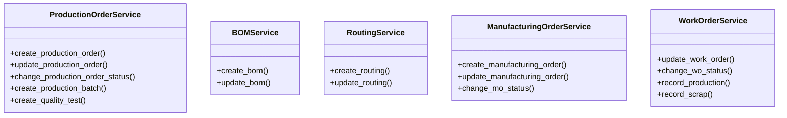

# business_modules.production.merged.services

## Imports
- decimal
- django.core.exceptions
- django.db
- django.utils
- django.utils.translation
- logging
- models

## Classes
- ProductionOrderService
  - method: `create_production_order`
  - method: `update_production_order`
  - method: `change_production_order_status`
  - method: `create_production_batch`
  - method: `create_quality_test`
- BOMService
  - method: `create_bom`
  - method: `update_bom`
- RoutingService
  - method: `create_routing`
  - method: `update_routing`
- ManufacturingOrderService
  - method: `create_manufacturing_order`
  - method: `update_manufacturing_order`
  - method: `change_mo_status`
- WorkOrderService
  - method: `update_work_order`
  - method: `change_wo_status`
  - method: `record_production`
  - method: `record_scrap`

## Functions
- _require
- _safe_set
- create_production_order
- update_production_order
- change_production_order_status
- create_production_batch
- create_quality_test
- create_bom
- update_bom
- create_routing
- update_routing
- create_manufacturing_order
- update_manufacturing_order
- change_mo_status
- update_work_order
- change_wo_status
- record_production
- record_scrap

## Module Variables
- `logger`

## Class Diagram

