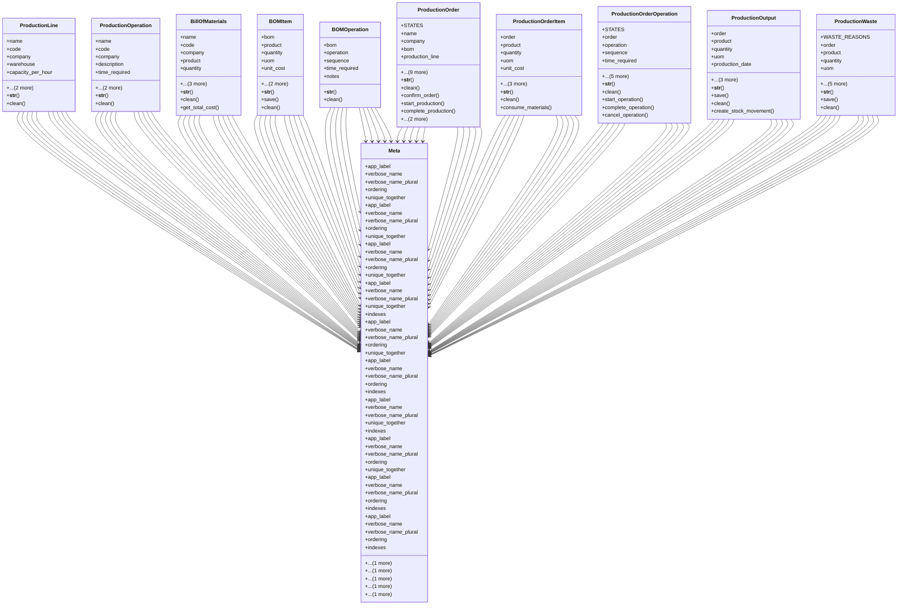

# business_modules.production.models

## Imports
- business_modules.inventory.models
- core_modules.companies.models
- decimal
- django.core.exceptions
- django.core.validators
- django.db
- django.utils
- django.utils.translation

## Classes
- ProductionLine
  - attr: `name`
  - attr: `code`
  - attr: `company`
  - attr: `warehouse`
  - attr: `capacity_per_hour`
  - attr: `is_active`
  - attr: `notes`
  - method: `__str__`
  - method: `clean`
- ProductionOperation
  - attr: `name`
  - attr: `code`
  - attr: `company`
  - attr: `description`
  - attr: `time_required`
  - attr: `is_active`
  - attr: `notes`
  - method: `__str__`
  - method: `clean`
- BillOfMaterials
  - attr: `name`
  - attr: `code`
  - attr: `company`
  - attr: `product`
  - attr: `quantity`
  - attr: `uom`
  - attr: `is_active`
  - attr: `notes`
  - method: `__str__`
  - method: `clean`
  - method: `get_total_cost`
- BOMItem
  - attr: `bom`
  - attr: `product`
  - attr: `quantity`
  - attr: `uom`
  - attr: `unit_cost`
  - attr: `subtotal`
  - attr: `notes`
  - method: `__str__`
  - method: `save`
  - method: `clean`
- BOMOperation
  - attr: `bom`
  - attr: `operation`
  - attr: `sequence`
  - attr: `time_required`
  - attr: `notes`
  - method: `__str__`
  - method: `clean`
- ProductionOrder
  - attr: `STATES`
  - attr: `name`
  - attr: `company`
  - attr: `bom`
  - attr: `production_line`
  - attr: `product`
  - attr: `quantity`
  - attr: `uom`
  - attr: `planned_start_date`
  - attr: `planned_end_date`
  - attr: `actual_start_date`
  - attr: `actual_end_date`
  - attr: `state`
  - attr: `notes`
  - method: `__str__`
  - method: `clean`
  - method: `confirm_order`
  - method: `start_production`
  - method: `complete_production`
  - method: `cancel_order`
  - method: `calculate_total_cost`
- ProductionOrderItem
  - attr: `order`
  - attr: `product`
  - attr: `quantity`
  - attr: `uom`
  - attr: `unit_cost`
  - attr: `subtotal`
  - attr: `consumed_quantity`
  - attr: `notes`
  - method: `__str__`
  - method: `clean`
  - method: `consume_materials`
- ProductionOrderOperation
  - attr: `STATES`
  - attr: `order`
  - attr: `operation`
  - attr: `sequence`
  - attr: `time_required`
  - attr: `actual_time`
  - attr: `start_time`
  - attr: `end_time`
  - attr: `state`
  - attr: `notes`
  - method: `__str__`
  - method: `clean`
  - method: `start_operation`
  - method: `complete_operation`
  - method: `cancel_operation`
- ProductionOutput
  - attr: `order`
  - attr: `product`
  - attr: `quantity`
  - attr: `uom`
  - attr: `production_date`
  - attr: `unit_cost`
  - attr: `total_cost`
  - attr: `notes`
  - method: `__str__`
  - method: `save`
  - method: `clean`
  - method: `create_stock_movement`
- ProductionWaste
  - attr: `WASTE_REASONS`
  - attr: `order`
  - attr: `product`
  - attr: `quantity`
  - attr: `uom`
  - attr: `waste_date`
  - attr: `reason`
  - attr: `unit_cost`
  - attr: `total_cost`
  - attr: `notes`
  - method: `__str__`
  - method: `save`
  - method: `clean`
- Meta
  - attr: `app_label`
  - attr: `verbose_name`
  - attr: `verbose_name_plural`
  - attr: `ordering`
  - attr: `unique_together`
  - attr: `indexes`
- Meta
  - attr: `app_label`
  - attr: `verbose_name`
  - attr: `verbose_name_plural`
  - attr: `ordering`
  - attr: `unique_together`
  - attr: `indexes`
- Meta
  - attr: `app_label`
  - attr: `verbose_name`
  - attr: `verbose_name_plural`
  - attr: `ordering`
  - attr: `unique_together`
  - attr: `indexes`
- Meta
  - attr: `app_label`
  - attr: `verbose_name`
  - attr: `verbose_name_plural`
  - attr: `unique_together`
  - attr: `indexes`
- Meta
  - attr: `app_label`
  - attr: `verbose_name`
  - attr: `verbose_name_plural`
  - attr: `ordering`
  - attr: `unique_together`
  - attr: `indexes`
- Meta
  - attr: `app_label`
  - attr: `verbose_name`
  - attr: `verbose_name_plural`
  - attr: `ordering`
  - attr: `indexes`
- Meta
  - attr: `app_label`
  - attr: `verbose_name`
  - attr: `verbose_name_plural`
  - attr: `unique_together`
  - attr: `indexes`
- Meta
  - attr: `app_label`
  - attr: `verbose_name`
  - attr: `verbose_name_plural`
  - attr: `ordering`
  - attr: `unique_together`
  - attr: `indexes`
- Meta
  - attr: `app_label`
  - attr: `verbose_name`
  - attr: `verbose_name_plural`
  - attr: `ordering`
  - attr: `indexes`
- Meta
  - attr: `app_label`
  - attr: `verbose_name`
  - attr: `verbose_name_plural`
  - attr: `ordering`
  - attr: `indexes`

## Functions
- __str__
- clean
- __str__
- clean
- __str__
- clean
- get_total_cost
- __str__
- save
- clean
- __str__
- clean
- __str__
- clean
- confirm_order
- start_production
- complete_production
- cancel_order
- calculate_total_cost
- __str__
- clean
- consume_materials
- __str__
- clean
- start_operation
- complete_operation
- cancel_operation
- __str__
- save
- clean
- create_stock_movement
- __str__
- save
- clean

## Class Diagram

