# business_modules.production.serializers

## Imports
- django.utils.translation
- models
- rest_framework

## Classes
- ProductionLineSerializer
- ProductionOperationSerializer
- BillOfMaterialsSerializer
- BOMItemSerializer
- BOMOperationSerializer
- ProductionOrderSerializer
- ProductionOrderOperationSerializer
- ProductionOutputSerializer
- Meta
  - attr: `model`
  - attr: `fields`
- Meta
  - attr: `model`
  - attr: `fields`
- Meta
  - attr: `model`
  - attr: `fields`
- Meta
  - attr: `model`
  - attr: `fields`
- Meta
  - attr: `model`
  - attr: `fields`
- Meta
  - attr: `model`
  - attr: `fields`
- Meta
  - attr: `model`
  - attr: `fields`
- Meta
  - attr: `model`
  - attr: `fields`

## Class Diagram

```mermaid
classDiagram
    class ProductionLineSerializer {
    }
    class ProductionOperationSerializer {
    }
    class BillOfMaterialsSerializer {
    }
    class BOMItemSerializer {
    }
    class BOMOperationSerializer {
    }
    class ProductionOrderSerializer {
    }
    class ProductionOrderOperationSerializer {
    }
    class ProductionOutputSerializer {
    }
    class Meta {
        +model
        +fields
    }
    class Meta {
        +model
        +fields
    }
    class Meta {
        +model
        +fields
    }
    class Meta {
        +model
        +fields
    }
    class Meta {
        +model
        +fields
    }
    class Meta {
        +model
        +fields
    }
    class Meta {
        +model
        +fields
    }
    class Meta {
        +model
        +fields
    }
    ProductionLineSerializer --> Meta
    ProductionLineSerializer --> Meta
    ProductionLineSerializer --> Meta
    ProductionLineSerializer --> Meta
    ProductionLineSerializer --> Meta
    ProductionLineSerializer --> Meta
    ProductionLineSerializer --> Meta
    ProductionLineSerializer --> Meta
    ProductionOperationSerializer --> Meta
    ProductionOperationSerializer --> Meta
    ProductionOperationSerializer --> Meta
    ProductionOperationSerializer --> Meta
    ProductionOperationSerializer --> Meta
    ProductionOperationSerializer --> Meta
    ProductionOperationSerializer --> Meta
    ProductionOperationSerializer --> Meta
    BillOfMaterialsSerializer --> Meta
    BillOfMaterialsSerializer --> Meta
    BillOfMaterialsSerializer --> Meta
    BillOfMaterialsSerializer --> Meta
    BillOfMaterialsSerializer --> Meta
    BillOfMaterialsSerializer --> Meta
    BillOfMaterialsSerializer --> Meta
    BillOfMaterialsSerializer --> Meta
    BOMItemSerializer --> Meta
    BOMItemSerializer --> Meta
    BOMItemSerializer --> Meta
    BOMItemSerializer --> Meta
    BOMItemSerializer --> Meta
    BOMItemSerializer --> Meta
    BOMItemSerializer --> Meta
    BOMItemSerializer --> Meta
    BOMOperationSerializer --> Meta
    BOMOperationSerializer --> Meta
    BOMOperationSerializer --> Meta
    BOMOperationSerializer --> Meta
    BOMOperationSerializer --> Meta
    BOMOperationSerializer --> Meta
    BOMOperationSerializer --> Meta
    BOMOperationSerializer --> Meta
    ProductionOrderSerializer --> Meta
    ProductionOrderSerializer --> Meta
    ProductionOrderSerializer --> Meta
    ProductionOrderSerializer --> Meta
    ProductionOrderSerializer --> Meta
    ProductionOrderSerializer --> Meta
    ProductionOrderSerializer --> Meta
    ProductionOrderSerializer --> Meta
    ProductionOrderOperationSerializer --> Meta
    ProductionOrderOperationSerializer --> Meta
    ProductionOrderOperationSerializer --> Meta
    ProductionOrderOperationSerializer --> Meta
    ProductionOrderOperationSerializer --> Meta
    ProductionOrderOperationSerializer --> Meta
    ProductionOrderOperationSerializer --> Meta
    ProductionOrderOperationSerializer --> Meta
    ProductionOutputSerializer --> Meta
    ProductionOutputSerializer --> Meta
    ProductionOutputSerializer --> Meta
    ProductionOutputSerializer --> Meta
    ProductionOutputSerializer --> Meta
    ProductionOutputSerializer --> Meta
    ProductionOutputSerializer --> Meta
    ProductionOutputSerializer --> Meta
```

